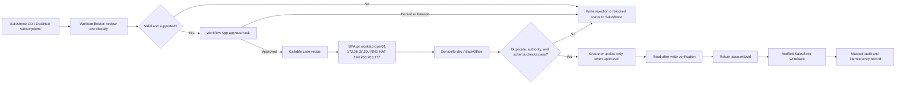

# Surface Workato OPA Technical Implementation Guide

**Status:** Donatello-dev proof of concept in preparation. Production BackOffice writes are blocked.

This is the concise operational reference for the Surface Customer Onboarding automation. The detailed source documents remain authoritative where they provide deeper implementation or security detail.

## 1. Objective

Automate a guarded onboarding flow from Salesforce to Surface BackOffice:

1. Review a Customer Onboarding (CO) record and related subscriptions.
2. Classify the onboarding scenario.
3. Stop on bad, incomplete, duplicate, or unsupported data.
4. Obtain human approval before any account action.
5. Use Workato through an on-prem agent (OPA) to access Donatello/BackOffice.
6. Check for duplicates, then create or update only when permitted.
7. Read the result back, return `accountUuid`, update Salesforce, and write a masked audit record.

Initial testing is only against Donatello dev (`https://donatello.dev.app.pentera.io`). BackOffice production (`https://app.pentera.io`) is not an approved write target.

## 2. Current State And Immediate Gate

### Technical readiness: passed

`workato-opa-01` is ready as the RND OPA candidate.

| Item | Result |
| --- | --- |
| VM | Ubuntu 22.04, VMware, `x86_64` |
| Capacity | 2 vCPU, 15 GiB RAM, 116 GiB disk |
| Static VM IP | `172.26.37.20/16` on VLAN 226 |
| Gateway | `172.26.0.1` |
| RND outbound NAT | `199.203.203.177` |
| Time | NTP synchronized |
| Workato gateways | `sg3.workato.com` and `sg4.workato.com` accept TCP 443 |
| Donatello dev | root returns `200`; unauthenticated APIs return `401` |

The detailed command output is [Day 1 VM preflight evidence](../outputs/day%201%20VM-%20Workado.out).

### Approval gate: pending

The captured Or/Ran security thread requires a short stakeholder security review before the next OPA test scope is approved. The requested decision is:

> Approve a controlled Donatello-dev OPA installation and authentication/duplicate-check test from `172.26.37.20`; prohibit all create actions and all production BackOffice access.

The security review must include Or, Ran Kadury, Elad Nadler, the automation owner, and relevant Surface/BackOffice and Salesforce owners. See [security review email thread](07_SECURITY_REVIEW_EMAIL_THREAD.md).

## 3. Target Architecture



### Components

| Component | Responsibility |
| --- | --- |
| Salesforce CO trigger | Starts the process in production; manual/API trigger is used in development. |
| `CO Source Review and Onboarding Router` | Validates source data, normalizes subscriptions, classifies the case, and applies rejection gates. |
| Workato Workflow App | Records human approval and, for a dev-only user flow, may collect a short-lived MFA code. |
| `surface-onboarding-rnd-opa` | Planned Workato on-prem group. |
| `surface-rnd-opa-01` | Planned Workato OPA agent hosted on `workato-opa-01`. |
| OPA-backed HTTP connection | Sends Donatello/BackOffice requests through the RND trusted-network path. |
| Callable case recipes | Perform case-specific validation and permitted API actions. |
| `surface_onboarding_idempotency` | Prevents duplicates and holds masked operational/audit data. |
| Salesforce writeback | Updates the approved UUID/status fields only after verification. |

## 4. Routing And Workflow Rules

The router must return a readable review summary plus structured fields including CO number, Salesforce record ID, account name/country/domains, subscriptions, existing IDs, engine value, rejection reasons, and Workato job ID.

| Case | Engine value | Current behavior |
| --- | --- | --- |
| 1: New Surface | `case_1_new_surface_only` | Map existing local logic into a callable Workato recipe. |
| 2: New Credential Exposure | `case_2_new_ce_only` | Current proof-of-concept focus; recipe scaffold exists. |
| 3: New Surface + New CE | `case_3_combined_baseline` | Stub and block until API/UI mapping exists. |
| 4: Renew Surface + New CE | `case_4_renew_surface_new_ce` | Stub and block until mapped. |
| 5: New Surface + Renew CE | `case_5_renew_ce_new_surface` | Stub and block until mapped. |
| 6: Renew Surface + Renew CE | `case_6_renew_both` | Stub and block until mapped. |

The current automatic rejection rule is:

> Reject when the Salesforce onboarding type does not match the license/subscription description or inferred motion.

Routes that are uncertain or not implemented must stop as `manual_review_required`, `case_not_mapped_yet`, or `source_data_mismatch`.

## 5. Case 2 Technical Sequence

Only run this sequence in Donatello dev and only after the security review approves the test scope.

1. Router validates a single CO record and classifies `case_2_new_ce_only`.
2. Human approves the reviewed request.
3. `Manual Case 2 - Donatello API` uses `Donatello Dev HTTP via RND OPA`.
4. Authenticate with `POST /api/v1/auth/login`.
5. Preserve MFA with `POST /api/v1/auth/verify` if required; the code is never logged or stored.
6. Check authorities with `GET /api/v1/authenticated/getAuthorities`.
7. Check duplicates with `POST /api/v1/backoffice/getAllDetailedAccounts`.
8. Build and review a masked dry-run payload.
9. Only after explicit approval, create through `POST /api/v1/backoffice/account/add`.
10. Re-query `getAllDetailedAccounts` to verify the new account and required settings.
11. Return `accountUuid`; only then write it to the Salesforce field approved by the Salesforce owner.

Required initial authorities are `AccessBackoffice`, `AddAccount`, and `GetAllDetailedAccounts`. The broader observed set includes `ViewLicense`, `EditLicense`, `UpdateAdvancedLeakedCredentialsSettings`, and `ViewInventoryLeakedCredentials`.

## 6. Security And Operations Controls

### Connectivity

- Preferred path: Workato Cloud → outbound OPA tunnel → RND Ubuntu VM → Donatello/BackOffice.
- The OPA host needs outbound TCP 443 to `sg3.workato.com` and `sg4.workato.com`; Workato requires no inbound firewall ports.
- TLS inspection must be bypassed only for the two Workato OPA gateway FQDNs. This remains a confirmation item for Networking/SecOps.
- Shared Workato cloud IP allowlisting is an alternative only after Cybersecurity review because the published egress IPs are multi-tenant.

### Identity, secrets, and logs

- MFA must remain enabled for user-based authentication. A manual Workato task is permitted only for a controlled dev proof of concept.
- Store endpoint and credential values in Workato environment properties or secure connections—not the VM, recipe comments, source files, chat, or tickets.
- Never log passwords, MFA codes, bearer tokens, cookies, full request bodies, or raw API responses.
- The OPA certificate expires after one year; record its expiry and set a renewal reminder at least 45 days beforehand.

### Fail-closed conditions

Stop immediately for ambiguous/missing CO records, source-data mismatch, unsupported cases, missing required fields, duplicate account/domain, missing authority, failed authentication, WAF/CloudFront block, inactive OPA, unexpected response schema, or denied/expired approval.

## 7. OPA Installation — Approved Scope Only

Do not apply manual OS upgrades (`apt upgrade`, `apt-get upgrade`, or `dist-upgrade`). The OPA package is a separate, controlled application installation after security-review approval.

In Workato, confirm the OPA entitlement, then create group `surface-onboarding-rnd-opa` and Linux DEB agent `surface-rnd-opa-01`. On the VM, run the current Workato installer commands:

```bash
echo 'deb [ signed-by=/usr/share/keyrings/workato.gpg ] https://workato-public.s3.amazonaws.com/DAA34553/repo/deb/ stable main' \
  | sudo tee /etc/apt/sources.list.d/workato.list

wget -qO - 'https://workato-public.s3.amazonaws.com/DAA34553/repo/archive.key' \
  | sudo gpg -o /usr/share/keyrings/workato.gpg --dearmor

sudo apt-get update
sudo apt-get install --no-upgrade -y workato-agent
```

Generate the one-hour activation command in the Workato wizard only when ready to use it. Do not place that command in files, tickets, chat, or logs. After activation:

```bash
sudo systemctl enable --now workato-agent.service
sudo systemctl is-enabled workato-agent.service
sudo systemctl is-active workato-agent.service
```

Complete setup by using **Test agent** in Workato.

## 8. Delivery Plan And Test Gates

| Phase | Deliverable | Exit gate |
| --- | --- | --- |
| 1. Infrastructure | RND VM, networking evidence, security-review approval | Approved OPA dev test scope. |
| 2. OPA | Active agent and OPA-backed Donatello connection | `Test agent` succeeds; no secrets on VM. |
| 3. Router | Six-case classification and rejection output | Bad/uncertain source data cannot call a case recipe. |
| 4. Approval | Auditable Workflow App decision | No onboarding runs without approval. |
| 5. Case 2 | Auth, MFA, authority, duplicate check, dry-run payload | Reaches app layer; duplicate creates are impossible. |
| 6. Other cases | Case 1 mapping; Cases 3–6 safe stubs/contracts | Unmapped cases stop safely. |
| 7. Writeback/audit | Idempotency, verified UUID writeback, masked logs | Salesforce changes only after read-after-write verification. |
| 8. Controlled dev test | One Donatello dev create, if separately approved | Create, verification, writeback, and negative tests pass. |
| 9. Production readiness | Reviewed security and operational evidence | Ran/Or, Product/CS, and Salesforce approvals are recorded. |

## 9. Open Decisions

| Owner | Decision required |
| --- | --- |
| Or, Ran, Elad, SecOps | Approve the next Donatello-dev OPA test scope; select the production connectivity/authentication model. |
| Donatello/Surface | Confirm whether `/api/v1/auth/token` can access required BackOffice operations and which scopes are needed. |
| Networking/SecOps | Confirm the `sg3`/`sg4` TLS-inspection bypass for the RND OPA host. |
| Workato | Confirm OPA entitlement and HTTP connector support for OPA connection profiles. |
| Salesforce owner | Confirm whether `accountUuid` updates `Surface_Account_ID__c`, `Account_UUID__c`, or both; define status and rejection fields. |

## 10. Reference Documents

- [Project handoff](00_PROJECT_HANDOFF.md)
- [Two-week implementation plan](01_TWO_WEEK_PLAN.md)
- [OPA VM requirements](02_OPA_UBUNTU22_VM_REQUIREMENTS.md)
- [Recipe architecture](03_WORKATO_RECIPE_ARCHITECTURE.md)
- [Security and risk review](04_SECURITY_AND_RISK_REVIEW.md)
- [Test plan and acceptance criteria](05_TEST_PLAN_AND_ACCEPTANCE.md)
- [Decision log and open items](06_DECISION_LOG_AND_OPEN_ITEMS.md)
- [Security review email thread](07_SECURITY_REVIEW_EMAIL_THREAD.md)
- [OPA preflight script](../scripts/ubuntu_opa_preflight.sh)
