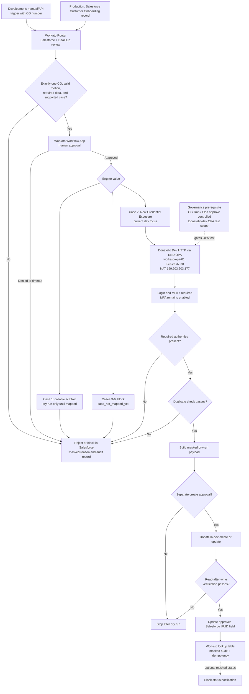

# Architecture Reconciliation: Legacy Slack Flow To Workato OPA Target

**Status:** Current technical direction as of 2026-07-13. This document resolves differences between the legacy Surface onboarding diagram and the Workato OPA design.

## Executive Decision

The legacy Slack Workflow Builder and Google Apps Script design is **not** the production automation platform. The target platform is Workato, using Salesforce and DealHub as the source of truth and an OPA-backed HTTP connection for trusted-network access to Donatello/BackOffice.

Slack may remain an optional status-notification channel. It must not be the authoritative intake, approval, audit, credential, MFA, or account-creation channel.

## Legacy Diagram Assessment

The supplied legacy diagram contains a useful business sequence—request, classify six cases, validate data, call an API, update Salesforce, and notify the requester—but it has architectural gaps that the Workato design closes.

| Legacy element | Keep, change, or retire | Current target |
| --- | --- | --- |
| CSM opens a request in Slack | Change | In development, use a manual/API Workato trigger with `co_number`; in production, Salesforce CO creation/update is the trigger. |
| Slack form with eight fields | Retire as source of truth | Workato reads and validates the Salesforce CO plus DealHub subscription context. |
| Six use cases | Keep | Workato Router classifies the six engine values. Only Case 2 is currently an active API proof-of-concept path. |
| Fill data / JSON payload | Change | Router produces a validated, normalized internal contract. Case recipes build a masked dry-run payload before any approved create. |
| Validate data from Salesforce | Keep and strengthen | Validate exactly one CO, subscription motion, required fields, existing IDs, duplicate state, and the current rejection gate. |
| Surface API | Change | Donatello dev API is reached through `workato-opa-01` and Workato OPA. Direct Workato cloud HTTP was blocked by WAF with `403`. |
| Update Salesforce UID/UUID | Keep and constrain | Write `accountUuid` only after read-after-write verification and Salesforce-owner confirmation of `Surface_Account_ID__c`, `Account_UUID__c`, or both. |
| Slack ongoing-status message / DM | Optional | Send only masked operational status after a state transition; never send credentials, MFA codes, tokens, or raw payloads. |
| Google Sheets audit dashboard | Retire as canonical audit | Use Workato lookup table `surface_onboarding_idempotency` for idempotency and masked audit data. A separate reporting export may be considered later. |
| Surface API stub | Retire | The target is a controlled Donatello-dev API proof of concept; BackOffice production writes remain blocked. |

## Current Authoritative Flow

## Current Security Position

1. **OPA is the preferred near-term connectivity path** because it originates Donatello/BackOffice traffic from the trusted RND network path rather than shared Workato cloud egress.
2. **OPA is not yet a production-architecture approval.** Or and Ran requested a short security review with Elad before selecting a production architecture or approving the next test scope.
3. **MFA remains mandatory** for any user-based authentication. A manual Workato task is a dev-only fallback, not an MFA bypass.
4. **Service-to-service authentication remains open.** `/api/v1/auth/token` may be preferable long term if it supports the required BackOffice operations and scopes.
5. **No production BackOffice write is allowed** until connectivity/authentication approval, case mapping approval, duplicate and verification evidence, Salesforce writeback validation, and rollback/stop procedures are complete.

## Current RND Evidence

`workato-opa-01` is a viable candidate for a controlled OPA test:

- Ubuntu 22.04, 2 vCPU, 15 GiB RAM, 116 GiB disk.
- Static IP `172.26.37.20/16` on VLAN 226; gateway `172.26.0.1`.
- Outbound NAT `199.203.203.177`.
- TCP 443 works to `sg3.workato.com` and `sg4.workato.com`.
- Donatello dev root returns `200`; unauthenticated API calls return `401` rather than WAF `403`.
- NTP is synchronized.

Networking/SecOps still needs to confirm that TLS inspection is bypassed only for `sg3.workato.com` and `sg4.workato.com`.

## Required Next Decision

The security-review meeting should approve or decline this bounded action:

> Install and activate one Workato OPA on `workato-opa-01`, create an OPA-backed Donatello-dev HTTP connection, and run authentication, authority, duplicate-check, and dry-run payload tests. Do not submit account creation, do not use production BackOffice, and do not remove MFA.

## Maintained Artifacts

- [Current technical implementation guide](08_TECHNICAL_IMPLEMENTATION_GUIDE.md)
- [Security review email thread](07_SECURITY_REVIEW_EMAIL_THREAD.md)
- [Current Workato OPA Mermaid source](../diagrams/surface_workato_opa_workflow_current.mmd)
- [Previous Workato OPA diagram](../diagrams/surface_workato_opa_workflow.svg)
