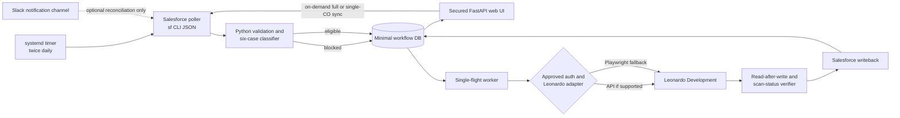

# Direct Salesforce-to-Surface Onboarding Integration Plan

**Date:** 2026-09-09  
**Status:** Planning baseline; no external system changes authorized or performed  
**Initial execution target:** Leonardo Development only  
**Production target:** Permanently blocked until a separate, recorded approval

## 1. Outcome

Build a Python service on the existing Ubuntu 22.04 VM that:

1. polls Salesforce twice per day for new or changed Customer Onboarding (CO) records;
2. validates and classifies all six supported onboarding cases;
3. places each CO in a secured web queue for five initial team members;
4. automatically provisions or updates the tenant in Leonardo Development through a supported API when one becomes available, or through guarded Playwright browser automation when no API exists;
5. performs duplicate checks, idempotency checks, and read-after-write verification;
6. writes the verified UUID, onboarding comment dates, and lifecycle stage back to Salesforce; and
7. retrieves and displays scanning state while persisting only information that is not already authoritative in Salesforce or Surface.

Workato is not part of the target runtime. Existing Workato/OPA material remains historical evidence until the direct integration passes its replacement gates.

## 2. Confirmed Decisions

| Area | Decision |
| --- | --- |
| Runtime | Python-first, directly integrated; no Workato dependency |
| Host | `workato-opa-01`, the current VMware Ubuntu 22.04 LTS x86-64 VM; direct service must be isolated from the OPA service identity and files |
| Initial target | Leonardo Development only |
| Production | Hard-blocked until a later explicit approval |
| Ingestion | Salesforce CLI polling twice per day plus authenticated on-demand synchronization |
| Trigger population | COs created by CSMs and visible in the Salesforce Open Onboardings population |
| Slack | `pentera-surface-onboarding` is a notification/reference channel, not the source of truth |
| Coverage | All six onboarding cases are in final scope |
| Users | Five initial operators |
| Salesforce writeback | Verified account UUID/Surface account ID, onboarding dates in comments, and lifecycle stages |
| Large-scope rule | Manual review if any root-domain, subdomain, combined, or licensed quantity threshold is greater than 60 |
| Data ownership | Do not persist copies of data already authoritative in Salesforce or Surface |

## 3. Evidence and Current Repository Assessment

### Reusable local implementation

- `phase1_validator` supplies strict comparison, source binding, date extraction, subscription selection, sanitized rejection notes, and fail-closed validation.
- `phase2_leonardo` supplies domain normalization, public-suffix handling, Case 3 preparation, strict JSON contracts, intent hashing, idempotency-key construction, approval constraints, result validation, and redacted evidence.
- The current local suite passes all 78 tests.
- Stable route identifiers must remain unchanged:
  - `case_1_new_surface_only`
  - `case_2_new_ce_only`
  - `case_3_combined_baseline`
  - `case_4_renew_surface_new_ce`
  - `case_5_renew_ce_new_surface`
  - `case_6_renew_both`

### Missing from the current repository

- deployable web application;
- persistent queue and workflow state;
- scheduled Salesforce poller;
- supported non-interactive Salesforce authentication configuration;
- Leonardo browser/API adapter;
- secure secret-provider integration;
- multi-user authentication and role enforcement;
- automated scan-status reconciliation;
- deployment packaging, service units, backup, monitoring, and recovery.

### Legacy `BO Onboarding` inventory

| Asset | Value | Planned disposition |
| --- | --- | --- |
| Salesforce `review-co.ps1` | Existing SOQL fields, route logic, subscription lookup, and CO normalization | Port useful query/normalization logic into tested Python modules; do not shell-wrap the whole PowerShell workflow |
| `create_case2_ce_bo.py` | Playwright selectors, form controls, duplicate lookup, response observation, and readback techniques | Use as reference only; rebuild behind a typed adapter and Leonardo-only origin allowlist |
| HAR/capture utilities | Sanitization and endpoint discovery ideas | Keep diagnostic-only; never retain raw HARs in the operational application |
| MFA prompt flow | Demonstrates transient operator input | Does not satisfy the fully unattended target; replace with an approved non-interactive authentication design |
| Local Fernet credential store | Avoids plaintext password at rest | Reject for server use because the decryption key is stored beside the ciphertext |
| PowerShell launchers | Useful operator workflow examples | Replace with one Python CLI and systemd services/timers |
| Export validator | Useful forbidden-file patterns | Port into CI and deployment checks |

The legacy package is production-oriented and Case-2-centric. Production URLs and behavior must not be copied into the new executable configuration.

### Guru evidence

| Card | State observed | Recency shown | Use |
| --- | --- | --- | --- |
| Surface & Credential Exposure Onboarding Guide | Unverified | Updated four months ago | Six-case routing and high-level process evidence only |
| Surface Customer Onboarding - Settings and Toggles | Verified | Updated 14 days ago | Current settings baseline, subject to explicit versioning and owner review |

The verified settings card requires explicit values for account settings, attack modules, and license controls. It also identifies conditional settings requiring senior, product, or account-team decisions. UI defaults are not authority.

### Slack evidence

Recent read-only inspection confirmed that channel notifications contain Salesforce deep links and a variable set of account, product, user, domain, CSM, and technical-advisor fields. Some messages omit fields; others place renewal prose where a domain would normally appear. Therefore:

- never create an execution manifest from Slack text;
- use the Salesforce record ID/CO link only as an optional reconciliation hint;
- obtain every executable value from a fresh Salesforce read;
- do not persist Slack message bodies.

## 4. Target Architecture



### Recommended components

| Component | Technology | Responsibility |
| --- | --- | --- |
| Application/API | Python 3.12+, FastAPI, Pydantic | Queue views, operator actions, validation endpoints, health checks |
| UI | Server-rendered Jinja templates plus HTMX | Small auditable UI without a separate JavaScript application |
| Operational database | Local PostgreSQL bound to loopback | Minimal workflow state, locks, approvals, audit metadata, Surface-only cache |
| Scheduler | systemd timer | Run reconciliation twice daily at configurable times |
| Salesforce adapter | `sf data query --json` and approved `sf data update` calls | Scheduled/on-demand source reads and verified writeback; parse JSON, never terminal-formatted output |
| Leonardo adapter | Typed interface with API and Playwright implementations | Keep workflow logic independent of transport |
| Browser worker | Playwright Chromium under a dedicated service account | Leonardo Development operations only; no production origin |
| Reverse proxy | Nginx or equivalent | TLS, request limits, security headers, SSO proxy integration |
| Process control | systemd | Separate web, scheduler, and worker services with least-privilege identities |

PostgreSQL is preferred over Redis plus another database: row locks and uniqueness constraints can provide the queue, audit, and single-flight behavior without a second persistence system.

## 5. Source of Truth and Minimal Persistence

### Salesforce remains authoritative for

- CO and Salesforce record identity;
- account, country, contacts, domains, product and onboarding type;
- DealHub subscriptions, quantities, status, dates, and revisions;
- onboarding approval and stage;
- onboarding comments;
- final Surface Account ID and/or Account UUID after verified writeback.

The UI should fetch these values live when opening a CO. They must not be copied into the operational database.

### Surface/Leonardo remains authoritative for

- tenant configuration;
- account UUID after creation;
- current feature/toggle/license state;
- scanning state and completion evidence;
- existing-account and duplicate state.

Surface values retrieved only through browser automation may be cached locally with `observed_at`, `expires_at`, source adapter/version, and a refresh control. Once a UUID or lifecycle result has been written successfully to Salesforce, remove the duplicate local value and retain only its hash and writeback receipt metadata.

### Local database may contain only

- Salesforce record ID and normalized CO number;
- Salesforce source revision/SystemModstamp;
- route engine value and policy version;
- workflow state and non-sensitive reason code;
- canonical intent hash and idempotency key;
- lock/lease state and attempt number;
- approval metadata if a manual-review flow is required;
- adapter version and masked failure category;
- timestamps and actor/service identity;
- short-lived Surface-only observations not stored elsewhere;
- writeback/readback receipt hashes, not raw payloads.

Do not store account names, domains, email addresses, contacts, raw comments, raw Salesforce results, raw Surface responses, screenshots, browser storage, passwords, MFA seeds/codes, cookies, tokens, HAR files, or authorization headers in the database or normal logs.

## 6. Queue and State Model

Use a small user-facing state set backed by a more precise internal state machine.

| UI state | Meaning | Typical Salesforce stage |
| --- | --- | --- |
| `Pending` | Newly discovered, awaiting validation, source correction, scheduled work, or manual decision | `New` |
| `Ready` | Source, route, mapping, threshold, duplicate, authentication, and idempotency gates passed | `Request Approved` |
| `Scanning` | Tenant is verified and Surface scanning is active | `Account Scanning` |
| `Finished` | Scan completed successfully; downstream user/finalization work may remain | `Scan Completed Successfully` or `User Created` |
| `Complete` | All required onboarding steps and Salesforce reconciliation succeeded | `Onboarding Completed` |

Add orthogonal filters rather than overloading the primary state:

- `manual_review_required`;
- `source_data_mismatch`;
- `duplicate_or_collision`;
- `authentication_blocked`;
- `mapping_not_approved`;
- `verification_failed`;
- `uncertain_external_result`;
- `retryable_read_failure`.

The exact Salesforce picklist spelling observed in the repository is `Request Approved`, not `Request Approval`. The application must read the live picklist metadata during implementation and fail closed if it differs.

### Required transitions

```text
discovered -> validating -> pending | manual_review_required | ready
ready -> executing -> verifying -> scanning
scanning -> finished -> complete
any pre-write state -> blocked
any uncertain mutation -> uncertain_external_result (no automatic retry)
```

Every transition must enforce an allowed-from state, expected Salesforce revision, idempotency key, and audit record in one database transaction.

## 7. Salesforce Intake and Writeback

### Polling

- Run two configurable polls per day. Deployment configuration will choose the exact times and timezone.
- Query the same logical population as the Salesforce `Open_Onboardings` list view.
- Initial known criteria are stage not equal to `Onboarding Completed` and approval status not equal to `Rejected`; verify the live list-view definition before implementation.
- Use a watermark plus overlap window so a delayed or missed run does not lose records.
- Reconcile by record ID and SystemModstamp; never by account name.
- Enforce exactly one CO record and unambiguous related records.
- A second fresh read immediately before any Leonardo mutation must match the reviewed revision.

### On-demand synchronization

Authorized `operator` and `admin` users may start either:

- a full refresh of the Salesforce Open Onboardings population; or
- a targeted refresh for one normalized CO number or Salesforce record ID.

Expose this through the web UI and the Python CLI. The web endpoint must be a CSRF-protected `POST`, return a generated synchronization job ID immediately, and execute the Salesforce CLI query in the background. It must not accept arbitrary SOQL, shell arguments, object names, or field lists from the caller.

An on-demand request uses the same fixed query definitions, source-revision checks, validation rules, queue upsert, locking, rate limits, timeout, and masked audit trail as a scheduled poll. Repeated requests for the same scope must coalesce while one is active. Triggering synchronization grants no special approval and cannot bypass a manual-review, mapping, duplicate, authentication, or production-origin gate.

The UI must show requested-by, requested-at, started-at, completed-at, outcome, and a non-sensitive failure category. It must never display or retain raw Salesforce CLI output.

Slack is not needed for correctness. A later optional Slack-events enhancement may shorten discovery latency, but it must only enqueue a Salesforce reread by record ID.

### Writeback order

1. Build and hash the exact intended Leonardo state.
2. Check duplicate and prior-attempt state.
3. Execute one idempotent Leonardo Development operation.
4. Re-read and verify UUID plus every required field/toggle/license value.
5. Update the exact approved Salesforce UUID field or fields.
6. Write the normalized date range as `YYYY-MM-DD - YYYY-MM-DD` using an owner-approved append/replace rule.
7. Advance only the stage supported by verified Surface evidence.
8. Re-read Salesforce and confirm exact persisted values.
9. Mark the local workflow transition complete and purge duplicate values.

No Salesforce stage may move ahead of verified external state. A failed Salesforce writeback after successful Leonardo creation must enter reconciliation, not rerun creation.

## 8. Six-Case Routing and Mapping

All six routes must be visible in the queue from the first release. Automated execution becomes enabled route-by-route only after each versioned mapping has passed owner review and Leonardo tests.

| Route | Intended operation |
| --- | --- |
| Case 1 | Create new Surface account only |
| Case 2 | Create new Credential Exposure-only account |
| Case 3 | Create combined Surface and Credential Exposure account |
| Case 4 | Update existing Surface tenant with new Credential Exposure |
| Case 5 | Update existing Credential Exposure tenant with new Surface |
| Case 6 | Renew/update both existing capabilities |

Each mapping must explicitly define:

- source fields and selected subscription rows;
- product/add-on allowlist;
- new-versus-renewal evidence;
- company and primary-user normalization;
- root domains, alternate domains, email domains, and subdomains;
- account type, country, operator account, and MFA behavior;
- all account settings and attack modules;
- license type, dates, assets, domain and subdomain quantities;
- duplicate/collision keys;
- create/update semantics;
- stable UUID discovery and complete readback;
- Salesforce fields and stage transitions.

Unknown products, add-ons, enums, UI controls, or source conflicts remain blocked. No route may inherit a Leonardo UI default silently.

## 9. Large-Scope Manual Review

Set `manual_review_required` before browser/API execution if any condition is true:

- distinct registrable root domains > 60;
- requested subdomains > 60;
- distinct roots plus subdomains > 60;
- any licensed domain or subdomain quantity > 60.

Also trigger manual review for malformed domain input, ambiguous root/subdomain classification, wildcard/public-suffix input, fake-domain requests, ownership exceptions, network ranges, special toggles, or any current/future policy flag.

The review page must display live Salesforce values, calculated counts, reason codes, source revision, and proposed mapping without persisting the values. A reviewer may reject, request correction, or release the exact revision and intent hash. Any source change invalidates the decision. Whether a released large-scope item continues automatically or remains operator-executed is an owner decision required before this path is enabled.

## 10. Authentication and MFA

The requested final state is fully unattended. That cannot safely be implemented with per-run human MFA. One of the following must be approved before unattended Leonardo mutations are enabled:

1. **Preferred:** official Leonardo API plus least-privilege workload identity and short-lived tokens;
2. **Fallback:** a dedicated automation identity with an approved TOTP mechanism whose seed is held by an enterprise secret manager and never exposed to the application database, files, environment dumps, logs, or UI;
3. **Temporary development bridge:** a persisted user browser session refreshed manually when it expires. This is not fully unattended and cannot be accepted as the final design.

MFA must not be disabled. The implementation must expose an authentication-health state and stop before any form activity when authentication cannot be established safely. CAPTCHA, WAF, unexpected SSO prompts, permission changes, or UI drift are hard stops.

The selected secret backend must provide audited access, rotation, host/workload binding, and revocation. Do not reuse the legacy side-by-side Fernet key/ciphertext design and do not store secrets in source control, PostgreSQL, browser profiles, shell history, or ordinary environment files.

## 11. Browser Automation Safety Contract

If no supported API exists, the Playwright adapter must:

- allow only the exact Leonardo Development HTTPS origin and reject redirects to production;
- run under a dedicated non-login Linux user with a private runtime directory;
- use one fresh context per operation unless an explicitly approved auth design requires otherwise;
- validate visible page identity and form schema before entering data;
- perform duplicate lookup before opening or filling the creation/update form;
- fill only versioned, owner-approved mappings;
- reread every control before submission;
- use an atomic single-flight lock and deterministic idempotency key;
- observe the submit response and reconcile uncertain results by read-only lookup;
- never automatically repeat an uncertain mutation;
- read the created/updated record back and verify every setting;
- retain masked structured evidence only;
- disable screenshots, traces, videos, HARs, and raw DOM dumps during normal operation.

Selectors should prefer stable test IDs or accessible labels. Any ambiguity, missing control, new enum, disabled control, or changed default blocks execution until the adapter and mapping are reviewed.

## 12. Web UI

### Queue page

- filters for Pending, Ready, Scanning, Finished, Complete, Manual Review, and Blocked;
- CO number with a Salesforce link;
- route/case, current stage, last source sync, and last Surface refresh;
- non-sensitive blocker/reason category;
- tenant creation verification indicator;
- manual refresh control for Surface-derived cached state;
- `Sync all from Salesforce` and `Refresh this CO` controls for authorized operators;
- synchronization job progress and last successful Salesforce refresh;
- sortable timestamps and assigned operator/reviewer when applicable.

### CO detail page

- live Salesforce review and source revision;
- calculated route and validation results;
- threshold counts and mapping version;
- proposed action and redacted intent hash;
- execution/readback/writeback timeline;
- manual-review decision controls for authorized reviewers only;
- no credential, token, cookie, raw payload, or raw-comment display.

### Access control

Use individual identities, not the shared VM account or a shared web password. Recommended roles:

- `viewer`: inspect queue and status;
- `operator`: refresh and run approved non-mutating checks;
- `reviewer`: decide manual-review items;
- `admin`: configuration and mapping deployment, not routine approval.

Corporate SSO/OIDC through a reverse proxy is preferred. The web UI must not be exposed until the identity mechanism and membership of the five-user pilot group are approved. Restrict network access to the approved corporate/RND path, enable TLS, rate limits, CSRF protection, secure cookies, and audit logging.

## 13. VM Migration and Deployment

Current verified platform baseline: Ubuntu 22.04 LTS, Linux 5.15, x86-64, VMware. Keep Ubuntu 22.04 for the first release.

Recommended future hostname: `surface-onboarding-01`. Do not rename the VM until Networking/SecOps confirms DNS, monitoring, certificates, backups, and any allowlist effects. The current hostname may remain during development.

### Safe migration sequence

1. Snapshot/backup the VM and inventory packages, services, ports, data directories, certificates, cron/systemd jobs, and monitoring dependencies.
2. Identify Workato-specific services and files; do not delete them yet.
3. Patch the OS through the approved maintenance process.
4. Create dedicated service identities and directories with least privilege.
5. Install pinned Python and Playwright dependencies from an approved internal source.
6. Deploy PostgreSQL loopback-only, the web service, scheduler, and worker.
7. Configure TLS, SSO/reverse proxy, firewall, log rotation, backups, and monitoring.
8. Run synthetic, read-only, and Leonardo Development acceptance gates.
9. Operate in shadow mode alongside the inactive/legacy assets long enough to reconcile queue results.
10. After acceptance and rollback approval, disable Workato services, observe, then uninstall the package and remove only an exact reviewed directory list.
11. Verify recovery, disk contents, open ports, running services, and production-origin blocking.
12. Rename the node only after dependent systems are updated and rollback is available.

These steps do not authorize any VM, DNS, firewall, package, Workato, Salesforce, or Leonardo change. Any later cleanup must use an exact reviewed path list; broad or recursive deletion against an unresolved path is prohibited.

## 14. Delivery Phases and Exit Gates

| Phase | Deliverable | Exit gate |
| --- | --- | --- |
| 0. Decisions and threat model | Auth/MFA, SSO, Salesforce field ownership, comment semantics, mapping owners | Every blocker in section 16 has a recorded owner decision |
| 1. Scaffold | Python package, FastAPI skeleton, migrations, config schema, CI, secret-provider interface | Unit tests, lint, type checks, secret scan pass |
| 2. Salesforce read path | Twice-daily poller, full and single-CO on-demand sync, live CO detail fetch, six-case classifier | Synthetic tests plus approved read-only Leonardo-independent validation |
| 3. Queue UI | Minimal DB, secure queue/detail pages, state transitions, RBAC | Five-user pilot access test; no source-data persistence |
| 4. Mapping registry | Versioned Cases 1-6 mappings and golden fixtures | Owners approve every field, toggle, entitlement, and exception rule |
| 5. Leonardo read-only adapter | Auth health, duplicate search, record/scan readback | Approved read-only tests; production origin demonstrably blocked |
| 6. Browser/API execution | Create/update adapter with locks and uncertainty reconciliation | Synthetic and fill-without-submit tests pass |
| 7. Controlled Leonardo writes | One separately approved Development test per route | Create/update plus complete readback succeeds for all six routes |
| 8. Salesforce writeback | UUID, dates/comments, and stage transitions with reread | Exact field and stage verification; failed writeback cannot rerun Leonardo |
| 9. Scan reconciliation | Scheduled and manual status refresh | Scanning, Finished, and Complete mappings verified |
| 10. Operational hardening | Monitoring, backup/restore, incident runbook, retention jobs | Security review and recovery exercise pass |
| 11. Workato retirement | Disable, observe, uninstall, and remove approved legacy paths | Replacement acceptance, backup, and rollback sign-off |

## 15. Test Strategy

### Local and CI

- preserve the current 78-test suite;
- add strict model/schema tests for every persisted and external contract;
- table-driven tests for all six route combinations and source mismatches;
- threshold boundary tests at 59, 60, and 61 for every quantity type;
- domain/public-suffix, IDN, wildcard, duplicate, and malformed-input tests;
- state-machine and forbidden-transition tests;
- idempotency and concurrent-worker tests;
- log/evidence leakage tests using canary secrets and personal data;
- production-origin denial tests;
- Salesforce CLI timeout, invalid JSON, auth expiry, and schema-drift tests;
- on-demand sync authorization, CSRF, rate-limit, job-coalescing, and arbitrary-query rejection tests;
- Playwright selector ambiguity and UI-drift tests against sanitized fixtures.

### Leonardo Development gates

1. connectivity and login-page identification only;
2. approved authentication-health test;
3. read-only duplicate lookup;
4. read-only existing-tenant and scan-status lookup;
5. form mapping inspection;
6. fill and reread without submit;
7. one controlled create/update per route;
8. independent readback and UUID verification;
9. Salesforce writeback in a separately approved step;
10. negative tests for duplicates, stale revisions, uncertain submission, expired auth, and UI drift.

Production BackOffice is not a test target.

## 16. Blocking Owner Decisions

| Blocker | Owner decision required |
| --- | --- |
| Fully unattended MFA | Leonardo Product/Engineering and SecOps must approve a workload identity/API or dedicated automation identity with secure automated MFA |
| Web UI identity | IT/SecOps must select SSO/OIDC or an equivalent individual-identity control for the five users |
| UUID destination | Salesforce owner must decide the case-by-case mapping for `Surface_Account_ID__c`, `Account_UUID__c`, or both |
| Comment update semantics | Salesforce/process owner must decide append versus replace, collision handling, and preservation of existing comments |
| Poll schedule | Operations owner must choose the two daily run times and timezone |
| Six-case mappings | CSE/Surface, Commercial/DealHub, and Leonardo owners must approve every setting and entitlement for each route |
| Large-scope release | Process/SecOps owners must decide whether approved >60 items resume automatically or remain operator-executed |
| Host rename | Infrastructure owner must approve the new hostname and dependent DNS/certificate/monitoring changes |
| Workato removal | Infrastructure and application owners must approve the exact package/directory removal list after replacement acceptance |
| Salesforce CLI service auth | Salesforce/SecOps owners must approve the server identity, org alias, token storage, rotation, and least-privilege permissions |

## 17. Immediate Next Safe Work

The next local-only implementation slice should create:

1. the Python project/package structure under `integration/`;
2. typed domain models and the internal state machine;
3. adapters with no-op/mock implementations for Salesforce, Leonardo, secrets, and persistence;
4. a versioned mapping registry with every route disabled by default;
5. the >60 manual-review policy and boundary tests;
6. a minimal FastAPI queue using synthetic records only;
7. CI checks that preserve the existing validator suite and prohibit sensitive artifacts.

The first slice should also define the on-demand synchronization command and HTTP contract using a mock Salesforce adapter; it must not call a live Salesforce org until the read-only service identity and test scope are approved.

This slice requires no external access or mutation. Salesforce reads, Slack ingestion, Leonardo authentication, browser form filling, VM deployment, and Salesforce writeback must each cross their documented approval and verification gate later.
