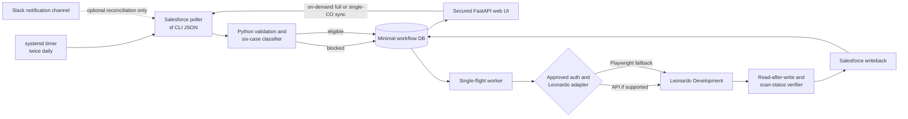

# Direct Salesforce-to-Surface Onboarding Integration Plan

**Date:** 2026-09-15
**Status (2026-09-29):** Attended local pilot **working end to end** for new Credential-Exposure-only COs in Leonardo Development. The attended runner created and read back **CO-0679** (Tango) and **CO-0728** (Bravoblox) fully automatically on 2026-09-29; **CO-0702** (manually created 9/25) was verified read-only. **CO-0762** (SIERRA) is ready and awaits the operator's click. Code is at `154846a` (local, not pushed). The authoritative handoff and next steps are the **2026-09-29 handoff** entry at the end of §18. Leonardo Development only; no Salesforce writeback; no production action.
**Initial execution target:** Leonardo Development only  
**Production target:** Permanently blocked until a separate, recorded approval

## 0. 2026-09-15 VM portability session handoff

This section is the authoritative handoff for continuing tomorrow. Earlier
references in this document to a five-user, fully unattended target remain
future-state planning; the current pilot is **Milton-only and attended**.

### Verified outcomes

- A sanitized project baseline is versioned at
  `https://github.com/mtms7/SurfaceOnboarding`.
- Latest UI commit: `cd21f18` (`Show runner requirement in VM dashboard`).
  Its GitHub Actions Ubuntu run #9 passed.
- Latest runner-contract documentation commit: `04e18c0`.
- Local full suite passed: **137 tests** (one Windows-only POSIX file-mode
  assertion skipped as intended). Artifact and offline-boundary guards passed.
- VM identity and capacity were checked read-only:
  - Host: `workato-opa-01` / `172.26.37.20`
  - Ubuntu 22.04 LTS; 101 GB free
  - application identity: `surface-onboarding` (UID/GID 998)
  - active and historical application directories were preserved.
- Existing managed runtime was located and verified:
  `/opt/surface-onboarding/runtime/python-3.12.14/bin/python3.12`.
  Ubuntu's default `python3` is 3.10 and cannot run this project because the
  project requires Python 3.12.
- The VM launcher now selects that managed Python 3.12 runtime, rejects a
  missing/wrong interpreter, requires a loopback listener, and requires the
  explicit web-identity marker before activation.
- Git now preserves `scripts/run_vm_dashboard.sh` as executable. Ubuntu CI
  verifies that mode; a Windows-created checkout cannot silently regress it.
- Non-active, versioned VM snapshots were created without overwriting the
  active application:
  - `app-r14-staged-20260915` at `8f2da13`
  - `app-r15-staged-20260915` at `39de9c4`
  - `app-r16-staged-20260915` at `08ab674`
  - `app-r17-staged-20260915` at `cd21f18`
- `r15` ran the complete VM suite successfully with Python 3.12.14:
  135 tests, artifact guard passed, offline-boundary guard passed.
- `r16` directly executed the launcher and correctly refused to activate
  without `SURFACE_ONBOARDING_WEB_IDENTITY_APPROVED=1` (expected exit status
  2). No listener started.
- The VM has no Salesforce CLI, Node.js, or browser runtime installed for the
  `surface-onboarding` identity. No authentication state was inspected.
- `r17` provides a VM-specific connection page: **Manual Salesforce runner is
  unavailable**. It contains no local Salesforce sign-in action in VM mode.
- A temporary, static, loopback-only preview of that page was started on
  `127.0.0.1:8013` and viewed through a MobaXterm local SSH tunnel. It has no
  Salesforce data by design; it proves the fail-closed UI only.

### Important boundaries preserved

- No service unit, proxy, firewall rule, VM package, OPA setting, Salesforce
  login, Salesforce read/write, Leonardo action, browser profile, cookie,
  token, password, MFA value, or production target was changed.
- The active legacy path `/opt/surface-onboarding/app` was not replaced.
- Browser/MFA state must not be placed on the dashboard VM or the Workato OPA
  host. The dashboard is loopback-only and cannot launch a browser in VM mode.
- The dashboard's static preview must not be interpreted as a live Salesforce
  test. It deliberately contains no queue data.

### Manual Salesforce runner design recorded

The non-executable design is documented in
`docs/36_MANUAL_SALESFORCE_RUNNER_CONTRACT.md`. It requires a separate,
ephemeral, Milton-only runner host. The runner keeps browser/CLI session
material local and returns only short-lived, schema-limited readiness or
allowlisted read results. It does not copy credentials, cookies, tokens, or MFA
values to the dashboard, OPA, Git, logs, or backups.

Required approvals before implementing or activating that runner:

1. Identity/SecOps: separate runner host, Milton-only access, lifecycle, and
   cleanup.
2. Salesforce: approved CLI/app identity, exact read scopes, and allowlisted
   query contract.
3. Security: mutual-TLS identity, forwarding/proxy topology, audit retention,
   monitoring, and incident handling.
4. Automation owner: exact first read-only pilot and rollback path.

### First steps tomorrow

1. Stop the current static preview with `Ctrl+C` in its VM terminal after UI
   review; verify the port is no longer listening. This is a temporary preview,
   not a service.
2. Decide and obtain approval for the separate, Milton-only runner host. Do
   not install a browser, Salesforce CLI, Node.js, or Playwright on
   `workato-opa-01`/the OPA host.
3. Implement the runner interface only as a typed, fixed-operation,
   fail-closed contract in the repository. It must not issue generic SOQL,
   arbitrary shell commands, or transfer CLI/browser session material.
4. Add dashboard handling for three attested runner states: `unavailable`,
   `ready`, and `failed`; continue to show no cached Salesforce data unless a
   fresh runner result is valid.
5. After the security approvals exist, provision the runner separately and
   perform one read-only, user-attended Salesforce session-health test. Do not
   start automated polling, Salesforce writeback, Leonardo interaction, or
   OPA changes.
6. Only after a separate web-identity/proxy approval may a temporary live
   dashboard listener be considered. Keep it at `127.0.0.1` and use explicit
   SSH forwarding for any pilot review.

## 1. Outcome

Build a Python service on the existing Ubuntu 22.04 VM that:

1. polls Salesforce twice per day for new or changed Customer Onboarding (CO) records;
2. validates and classifies all six supported onboarding cases;
3. places each CO in a secured web queue for five initial team members;
4. automatically provisions or updates the tenant in Leonardo Development through a supported API when one becomes available, or through guarded Playwright browser automation when no API exists;
5. performs duplicate checks, idempotency checks, and read-after-write verification;
6. writes the verified UUID, onboarding comment dates, and lifecycle stage back to Salesforce; and
7. retrieves and displays scanning state while persisting only information that is not already authoritative in Salesforce or Surface.

Workato is not part of the target runtime. Existing Workato/OPA material remains historical evidence until the direct integration passes its replacement gates.

## 2. Confirmed Decisions

| Area | Decision |
| --- | --- |
| Runtime | Python-first, directly integrated; no Workato dependency |
| Host | `workato-opa-01`, the current VMware Ubuntu 22.04 LTS x86-64 VM; direct service must be isolated from the OPA service identity and files |
| Initial target | Leonardo Development only |
| Production | Hard-blocked until a later explicit approval |
| Ingestion | Salesforce CLI polling twice per day plus authenticated on-demand synchronization |
| Trigger population | COs created by CSMs and visible in the Salesforce Open Onboardings population |
| Slack | `pentera-surface-onboarding` is a notification/reference channel, not the source of truth |
| Coverage | All six onboarding cases are in final scope |
| Users | Five initial operators |
| Salesforce writeback | Verified account UUID/Surface account ID, onboarding dates in comments, and lifecycle stages |
| Large-scope rule | Manual review if any root-domain, subdomain, combined, or licensed quantity threshold is greater than 60 |
| Data ownership | Do not persist copies of data already authoritative in Salesforce or Surface |

## 3. Evidence and Current Repository Assessment

### Reusable local implementation

- `phase1_validator` supplies strict comparison, source binding, date extraction, subscription selection, sanitized rejection notes, and fail-closed validation.
- `phase2_leonardo` supplies domain normalization, public-suffix handling, Case 3 preparation, strict JSON contracts, intent hashing, idempotency-key construction, approval constraints, result validation, and redacted evidence.
- The current local suite passes all 78 tests.
- Stable route identifiers must remain unchanged:
  - `case_1_new_surface_only`
  - `case_2_new_ce_only`
  - `case_3_combined_baseline`
  - `case_4_renew_surface_new_ce`
  - `case_5_renew_ce_new_surface`
  - `case_6_renew_both`

### Missing from the current repository

- deployable web application;
- persistent queue and workflow state;
- scheduled Salesforce poller;
- supported non-interactive Salesforce authentication configuration;
- Leonardo browser/API adapter;
- secure secret-provider integration;
- multi-user authentication and role enforcement;
- automated scan-status reconciliation;
- deployment packaging, service units, backup, monitoring, and recovery.

### Legacy `BO Onboarding` inventory

| Asset | Value | Planned disposition |
| --- | --- | --- |
| Salesforce `review-co.ps1` | Existing SOQL fields, route logic, subscription lookup, and CO normalization | Port useful query/normalization logic into tested Python modules; do not shell-wrap the whole PowerShell workflow |
| `create_case2_ce_bo.py` | Playwright selectors, form controls, duplicate lookup, response observation, and readback techniques | Use as reference only; rebuild behind a typed adapter and Leonardo-only origin allowlist |
| HAR/capture utilities | Sanitization and endpoint discovery ideas | Keep diagnostic-only; never retain raw HARs in the operational application |
| MFA prompt flow | Demonstrates transient operator input | Does not satisfy the fully unattended target; replace with an approved non-interactive authentication design |
| Local Fernet credential store | Avoids plaintext password at rest | Reject for server use because the decryption key is stored beside the ciphertext |
| PowerShell launchers | Useful operator workflow examples | Replace with one Python CLI and systemd services/timers |
| Export validator | Useful forbidden-file patterns | Port into CI and deployment checks |

The legacy package is production-oriented and Case-2-centric. Production URLs and behavior must not be copied into the new executable configuration.

### Guru evidence

| Card | State observed | Recency shown | Use |
| --- | --- | --- | --- |
| Surface & Credential Exposure Onboarding Guide | Unverified | Updated four months ago | Six-case routing and high-level process evidence only |
| Surface Customer Onboarding - Settings and Toggles | Verified | Updated 14 days ago | Current settings baseline, subject to explicit versioning and owner review |

The verified settings card requires explicit values for account settings, attack modules, and license controls. It also identifies conditional settings requiring senior, product, or account-team decisions. UI defaults are not authority.

### Slack evidence

Recent read-only inspection confirmed that channel notifications contain Salesforce deep links and a variable set of account, product, user, domain, CSM, and technical-advisor fields. Some messages omit fields; others place renewal prose where a domain would normally appear. Therefore:

- never create an execution manifest from Slack text;
- use the Salesforce record ID/CO link only as an optional reconciliation hint;
- obtain every executable value from a fresh Salesforce read;
- do not persist Slack message bodies.

## 4. Target Architecture


```mermaid
flowchart LR
    T[systemd timer\ntwice daily] --> P[Salesforce poller\nsf CLI JSON]
    UI -->|on-demand full or single-CO sync| P
    P --> V[Python validation and\nsix-case classifier]
    V -->|blocked| Q[(Minimal workflow DB)]
    V -->|eligible| Q
    Q --> UI[Secured FastAPI web UI]
    Q --> W[Single-flight worker]
    W --> A{Approved auth and\nLeonardo adapter}
    A -->|API if supported| L[Leonardo Development]
    A -->|Playwright fallback| L
    L --> R[Read-after-write and\nscan-status verifier]
    R --> S[Salesforce writeback]
    S --> Q
    SL[Slack notification channel] -. optional reconciliation only .-> P
```

### Recommended components

| Component | Technology | Responsibility |
| --- | --- | --- |
| Application/API | Python 3.12+, FastAPI, Pydantic | Queue views, operator actions, validation endpoints, health checks |
| UI | Server-rendered Jinja templates plus HTMX | Small auditable UI without a separate JavaScript application |
| Operational database | Local PostgreSQL bound to loopback | Minimal workflow state, locks, approvals, audit metadata, Surface-only cache |
| Scheduler | systemd timer | Run reconciliation twice daily at configurable times |
| Salesforce adapter | `sf data query --json` and approved `sf data update` calls | Scheduled/on-demand source reads and verified writeback; parse JSON, never terminal-formatted output |
| Leonardo adapter | Typed interface with API and Playwright implementations | Keep workflow logic independent of transport |
| Browser worker | Playwright Chromium under a dedicated service account | Leonardo Development operations only; no production origin |
| Reverse proxy | Nginx or equivalent | TLS, request limits, security headers, SSO proxy integration |
| Process control | systemd | Separate web, scheduler, and worker services with least-privilege identities |

PostgreSQL is preferred over Redis plus another database: row locks and uniqueness constraints can provide the queue, audit, and single-flight behavior without a second persistence system.

## 5. Source of Truth and Minimal Persistence

### Salesforce remains authoritative for

- CO and Salesforce record identity;
- account, country, contacts, domains, product and onboarding type;
- DealHub subscriptions, quantities, status, dates, and revisions;
- onboarding approval and stage;
- onboarding comments;
- final Surface Account ID and/or Account UUID after verified writeback.

The UI should fetch these values live when opening a CO. They must not be copied into the operational database.

### Surface/Leonardo remains authoritative for

- tenant configuration;
- account UUID after creation;
- current feature/toggle/license state;
- scanning state and completion evidence;
- existing-account and duplicate state.

Surface values retrieved only through browser automation may be cached locally with `observed_at`, `expires_at`, source adapter/version, and a refresh control. Once a UUID or lifecycle result has been written successfully to Salesforce, remove the duplicate local value and retain only its hash and writeback receipt metadata.

### Local database may contain only

- Salesforce record ID and normalized CO number;
- Salesforce source revision/SystemModstamp;
- route engine value and policy version;
- workflow state and non-sensitive reason code;
- canonical intent hash and idempotency key;
- lock/lease state and attempt number;
- approval metadata if a manual-review flow is required;
- adapter version and masked failure category;
- timestamps and actor/service identity;
- short-lived Surface-only observations not stored elsewhere;
- writeback/readback receipt hashes, not raw payloads.

Do not store account names, domains, email addresses, contacts, raw comments, raw Salesforce results, raw Surface responses, screenshots, browser storage, passwords, MFA seeds/codes, cookies, tokens, HAR files, or authorization headers in the database or normal logs.

## 6. Queue and State Model

Use a small user-facing state set backed by a more precise internal state machine.

| UI state | Meaning | Typical Salesforce stage |
| --- | --- | --- |
| `Pending` | Newly discovered, awaiting validation, source correction, scheduled work, or manual decision | `New` |
| `Ready` | Source, route, mapping, threshold, duplicate, authentication, and idempotency gates passed | `Request Approved` |
| `Scanning` | Tenant is verified and Surface scanning is active | `Account Scanning` |
| `Finished` | Scan completed successfully; downstream user/finalization work may remain | `Scan Completed Successfully` or `User Created` |
| `Complete` | All required onboarding steps and Salesforce reconciliation succeeded | `Onboarding Completed` |

Add orthogonal filters rather than overloading the primary state:

- `manual_review_required`;
- `source_data_mismatch`;
- `duplicate_or_collision`;
- `authentication_blocked`;
- `mapping_not_approved`;
- `verification_failed`;
- `uncertain_external_result`;
- `retryable_read_failure`.

The exact Salesforce picklist spelling observed in the repository is `Request Approved`, not `Request Approval`. The application must read the live picklist metadata during implementation and fail closed if it differs.

### Required transitions

```text
discovered -> validating -> pending | manual_review_required | ready
ready -> executing -> verifying -> scanning
scanning -> finished -> complete
any pre-write state -> blocked
any uncertain mutation -> uncertain_external_result (no automatic retry)
```

Every transition must enforce an allowed-from state, expected Salesforce revision, idempotency key, and audit record in one database transaction.

## 7. Salesforce Intake and Writeback

### Polling

- Run two configurable polls per day. Deployment configuration will choose the exact times and timezone.
- Query the same logical population as the Salesforce `Open_Onboardings` list view.
- Initial known criteria are stage not equal to `Onboarding Completed` and approval status not equal to `Rejected`; verify the live list-view definition before implementation.
- Use a watermark plus overlap window so a delayed or missed run does not lose records.
- Reconcile by record ID and SystemModstamp; never by account name.
- Enforce exactly one CO record and unambiguous related records.
- A second fresh read immediately before any Leonardo mutation must match the reviewed revision.

### On-demand synchronization

Authorized `operator` and `admin` users may start either:

- a full refresh of the Salesforce Open Onboardings population; or
- a targeted refresh for one normalized CO number or Salesforce record ID.

Expose this through the web UI and the Python CLI. The web endpoint must be a CSRF-protected `POST`, return a generated synchronization job ID immediately, and execute the Salesforce CLI query in the background. It must not accept arbitrary SOQL, shell arguments, object names, or field lists from the caller.

An on-demand request uses the same fixed query definitions, source-revision checks, validation rules, queue upsert, locking, rate limits, timeout, and masked audit trail as a scheduled poll. Repeated requests for the same scope must coalesce while one is active. Triggering synchronization grants no special approval and cannot bypass a manual-review, mapping, duplicate, authentication, or production-origin gate.

The UI must show requested-by, requested-at, started-at, completed-at, outcome, and a non-sensitive failure category. It must never display or retain raw Salesforce CLI output.

Slack is not needed for correctness. A later optional Slack-events enhancement may shorten discovery latency, but it must only enqueue a Salesforce reread by record ID.

### Writeback order

1. Build and hash the exact intended Leonardo state.
2. Check duplicate and prior-attempt state.
3. Execute one idempotent Leonardo Development operation.
4. Re-read and verify UUID plus every required field/toggle/license value.
5. Update the exact approved Salesforce UUID field or fields.
6. Write the normalized date range as `YYYY-MM-DD - YYYY-MM-DD` using an owner-approved append/replace rule.
7. Advance only the stage supported by verified Surface evidence.
8. Re-read Salesforce and confirm exact persisted values.
9. Mark the local workflow transition complete and purge duplicate values.

No Salesforce stage may move ahead of verified external state. A failed Salesforce writeback after successful Leonardo creation must enter reconciliation, not rerun creation.

## 8. Six-Case Routing and Mapping

All six routes must be visible in the queue from the first release. Automated execution becomes enabled route-by-route only after each versioned mapping has passed owner review and Leonardo tests.

| Route | Intended operation |
| --- | --- |
| Case 1 | Create new Surface account only |
| Case 2 | Create new Credential Exposure-only account |
| Case 3 | Create combined Surface and Credential Exposure account |
| Case 4 | Update existing Surface tenant with new Credential Exposure |
| Case 5 | Update existing Credential Exposure tenant with new Surface |
| Case 6 | Renew/update both existing capabilities |

Each mapping must explicitly define:

- source fields and selected subscription rows;
- product/add-on allowlist;
- new-versus-renewal evidence;
- company and primary-user normalization;
- root domains, alternate domains, email domains, and subdomains;
- account type, country, operator account, and MFA behavior;
- all account settings and attack modules;
- license type, dates, assets, domain and subdomain quantities;
- duplicate/collision keys;
- create/update semantics;
- stable UUID discovery and complete readback;
- Salesforce fields and stage transitions.

Unknown products, add-ons, enums, UI controls, or source conflicts remain blocked. No route may inherit a Leonardo UI default silently.

## 9. Large-Scope Manual Review

Set `manual_review_required` before browser/API execution if any condition is true:

- distinct registrable root domains > 60;
- requested subdomains > 60;
- distinct roots plus subdomains > 60;
- any licensed domain or subdomain quantity > 60.

Also trigger manual review for malformed domain input, ambiguous root/subdomain classification, wildcard/public-suffix input, fake-domain requests, ownership exceptions, network ranges, special toggles, or any current/future policy flag.

The review page must display live Salesforce values, calculated counts, reason codes, source revision, and proposed mapping without persisting the values. A reviewer may reject, request correction, or release the exact revision and intent hash. Any source change invalidates the decision. Whether a released large-scope item continues automatically or remains operator-executed is an owner decision required before this path is enabled.

## 10. Authentication and MFA

The requested final state is fully unattended. That cannot safely be implemented with per-run human MFA. One of the following must be approved before unattended Leonardo mutations are enabled:

1. **Preferred:** official Leonardo API plus least-privilege workload identity and short-lived tokens;
2. **Fallback:** a dedicated automation identity with an approved TOTP mechanism whose seed is held by an enterprise secret manager and never exposed to the application database, files, environment dumps, logs, or UI;
3. **Temporary development bridge:** a persisted user browser session refreshed manually when it expires. This is not fully unattended and cannot be accepted as the final design. **Selected for the attended pilot (2026-09-24):** the runner uses a dedicated persisted Leonardo automation profile on the operator's desktop. The first run performs SSO/MFA once; later runs reuse the session until expiry. A "Reset Leonardo session" button wipes the profile. The profile is never stored on the VM, in Git, in logs, or in backups, and is isolated from the operator's main Chrome profile.

MFA must not be disabled. The implementation must expose an authentication-health state and stop before any form activity when authentication cannot be established safely. CAPTCHA, WAF, unexpected SSO prompts, permission changes, or UI drift are hard stops.

The selected secret backend must provide audited access, rotation, host/workload binding, and revocation. Do not reuse the legacy side-by-side Fernet key/ciphertext design and do not store secrets in source control, PostgreSQL, browser profiles, shell history, or ordinary environment files.

## 11. Browser Automation Safety Contract

If no supported API exists, the Playwright adapter must:

- allow only the exact Leonardo Development HTTPS origin and reject redirects to production;
- run under a dedicated non-login Linux user with a private runtime directory;
- use one fresh context per operation unless an explicitly approved auth design requires otherwise;
- validate visible page identity and form schema before entering data;
- perform duplicate lookup before opening or filling the creation/update form;
- fill only versioned, owner-approved mappings;
- reread every control before submission;
- use an atomic single-flight lock and deterministic idempotency key;
- observe the submit response and reconcile uncertain results by read-only lookup;
- never automatically repeat an uncertain mutation;
- read the created/updated record back and verify every setting;
- retain masked structured evidence only;
- disable screenshots, traces, videos, HARs, and raw DOM dumps during normal operation.

Selectors should prefer stable test IDs or accessible labels. Any ambiguity, missing control, new enum, disabled control, or changed default blocks execution until the adapter and mapping are reviewed.

## 12. Web UI

### Queue page

- filters for Pending, Ready, Scanning, Finished, Complete, Manual Review, and Blocked;
- CO number with a Salesforce link;
- route/case, current stage, last source sync, and last Surface refresh;
- non-sensitive blocker/reason category;
- tenant creation verification indicator;
- manual refresh control for Surface-derived cached state;
- `Sync all from Salesforce` and `Refresh this CO` controls for authorized operators;
- synchronization job progress and last successful Salesforce refresh;
- sortable timestamps and assigned operator/reviewer when applicable.

### CO detail page

- live Salesforce review and source revision;
- calculated route and validation results;
- threshold counts and mapping version;
- proposed action and redacted intent hash;
- execution/readback/writeback timeline;
- manual-review decision controls for authorized reviewers only;
- no credential, token, cookie, raw payload, or raw-comment display.

### Access control

Use individual identities, not the shared VM account or a shared web password. Recommended roles:

- `viewer`: inspect queue and status;
- `operator`: refresh and run approved non-mutating checks;
- `reviewer`: decide manual-review items;
- `admin`: configuration and mapping deployment, not routine approval.

Corporate SSO/OIDC through a reverse proxy is preferred. The web UI must not be exposed until the identity mechanism and membership of the five-user pilot group are approved. Restrict network access to the approved corporate/RND path, enable TLS, rate limits, CSRF protection, secure cookies, and audit logging.

## 13. VM Migration and Deployment

Current verified platform baseline: Ubuntu 22.04 LTS, Linux 5.15, x86-64, VMware. Keep Ubuntu 22.04 for the first release.

Recommended future hostname: `surface-onboarding-01`. Do not rename the VM until Networking/SecOps confirms DNS, monitoring, certificates, backups, and any allowlist effects. The current hostname may remain during development.

### Safe migration sequence

1. Snapshot/backup the VM and inventory packages, services, ports, data directories, certificates, cron/systemd jobs, and monitoring dependencies.
2. Identify Workato-specific services and files; do not delete them yet.
3. Patch the OS through the approved maintenance process.
4. Create dedicated service identities and directories with least privilege.
5. Install pinned Python and Playwright dependencies from an approved internal source.
6. Deploy PostgreSQL loopback-only, the web service, scheduler, and worker.
7. Configure TLS, SSO/reverse proxy, firewall, log rotation, backups, and monitoring.
8. Run synthetic, read-only, and Leonardo Development acceptance gates.
9. Operate in shadow mode alongside the inactive/legacy assets long enough to reconcile queue results.
10. After acceptance and rollback approval, disable Workato services, observe, then uninstall the package and remove only an exact reviewed directory list.
11. Verify recovery, disk contents, open ports, running services, and production-origin blocking.
12. Rename the node only after dependent systems are updated and rollback is available.

These steps do not authorize any VM, DNS, firewall, package, Workato, Salesforce, or Leonardo change. Any later cleanup must use an exact reviewed path list; broad or recursive deletion against an unresolved path is prohibited.

## 14. Delivery Phases and Exit Gates

| Phase | Deliverable | Exit gate |
| --- | --- | --- |
| 0. Decisions and threat model | Auth/MFA, SSO, Salesforce field ownership, comment semantics, mapping owners | Every blocker in section 16 has a recorded owner decision |
| 1. Scaffold | Python package, FastAPI skeleton, migrations, config schema, CI, secret-provider interface | Unit tests, lint, type checks, secret scan pass |
| 2. Salesforce read path | Twice-daily poller, full and single-CO on-demand sync, live CO detail fetch, six-case classifier | Synthetic tests plus approved read-only Leonardo-independent validation |
| 3. Queue UI | Minimal DB, secure queue/detail pages, state transitions, RBAC | Five-user pilot access test; no source-data persistence |
| 4. Mapping registry | Versioned Cases 1-6 mappings and golden fixtures | Owners approve every field, toggle, entitlement, and exception rule |
| 5. Leonardo read-only adapter | Auth health, duplicate search, record/scan readback | Approved read-only tests; production origin demonstrably blocked |
| 6. Browser/API execution | Create/update adapter with locks and uncertainty reconciliation | Synthetic and fill-without-submit tests pass |
| 7. Controlled Leonardo writes | One separately approved Development test per route | Create/update plus complete readback succeeds for all six routes |
| 8. Salesforce writeback | UUID, dates/comments, and stage transitions with reread | Exact field and stage verification; failed writeback cannot rerun Leonardo |
| 9. Scan reconciliation | Scheduled and manual status refresh | Scanning, Finished, and Complete mappings verified |
| 10. Operational hardening | Monitoring, backup/restore, incident runbook, retention jobs | Security review and recovery exercise pass |
| 11. Workato retirement | Disable, observe, uninstall, and remove approved legacy paths | Replacement acceptance, backup, and rollback sign-off |

## 15. Test Strategy

### Local and CI

- preserve the current 78-test suite;
- add strict model/schema tests for every persisted and external contract;
- table-driven tests for all six route combinations and source mismatches;
- threshold boundary tests at 59, 60, and 61 for every quantity type;
- domain/public-suffix, IDN, wildcard, duplicate, and malformed-input tests;
- state-machine and forbidden-transition tests;
- idempotency and concurrent-worker tests;
- log/evidence leakage tests using canary secrets and personal data;
- production-origin denial tests;
- Salesforce CLI timeout, invalid JSON, auth expiry, and schema-drift tests;
- on-demand sync authorization, CSRF, rate-limit, job-coalescing, and arbitrary-query rejection tests;
- Playwright selector ambiguity and UI-drift tests against sanitized fixtures.

### Leonardo Development gates

1. connectivity and login-page identification only;
2. approved authentication-health test;
3. read-only duplicate lookup;
4. read-only existing-tenant and scan-status lookup;
5. form mapping inspection;
6. fill and reread without submit;
7. one controlled create/update per route;
8. independent readback and UUID verification;
9. Salesforce writeback in a separately approved step;
10. negative tests for duplicates, stale revisions, uncertain submission, expired auth, and UI drift.

Production BackOffice is not a test target.

## 16. Blocking Owner Decisions

| Blocker | Owner decision required |
| --- | --- |
| Fully unattended MFA | Leonardo Product/Engineering and SecOps must approve a workload identity/API or dedicated automation identity with secure automated MFA |
| Web UI identity | IT/SecOps must select SSO/OIDC or an equivalent individual-identity control for the five users |
| UUID destination | Salesforce owner must decide the case-by-case mapping for `Surface_Account_ID__c`, `Account_UUID__c`, or both |
| Comment update semantics | Salesforce/process owner must decide append versus replace, collision handling, and preservation of existing comments |
| Poll schedule | Operations owner must choose the two daily run times and timezone |
| Six-case mappings | CSE/Surface, Commercial/DealHub, and Leonardo owners must approve every setting and entitlement for each route |
| Large-scope release | Process/SecOps owners must decide whether approved >60 items resume automatically or remain operator-executed |
| Host rename | Infrastructure owner must approve the new hostname and dependent DNS/certificate/monitoring changes |
| Workato removal | Infrastructure and application owners must approve the exact package/directory removal list after replacement acceptance |
| Salesforce CLI service auth | Salesforce/SecOps owners must approve the server identity, org alias, token storage, rotation, and least-privilege permissions |

## 17. Immediate Next Safe Work

The next local-only implementation slice should create:

1. the Python project/package structure under `integration/`;
2. typed domain models and the internal state machine;
3. adapters with no-op/mock implementations for Salesforce, Leonardo, secrets, and persistence;
4. a versioned mapping registry with every route disabled by default;
5. the >60 manual-review policy and boundary tests;
6. a minimal FastAPI queue using synthetic records only;
7. CI checks that preserve the existing validator suite and prohibit sensitive artifacts.

The first slice should also define the on-demand synchronization command and HTTP contract using a mock Salesforce adapter; it must not call a live Salesforce org until the read-only service identity and test scope are approved.

This slice requires no external access or mutation. Salesforce reads, Slack ingestion, Leonardo authentication, browser form filling, VM deployment, and Salesforce writeback must each cross their documented approval and verification gate later.

## 18. Attended Local Pilot Handoff — 2026-09-17/18

### Completed and verified

- The local attended dashboard runs on `127.0.0.1:8012` under the desktop user's Salesforce CLI session. It must not be run on the Ubuntu OPA VM for browser/MFA work.
- CO-0741 has a revision-bound Salesforce comment-repair flow with fresh source reads and readback verification.
- CO-0745 has a read-only renewal-term evaluator and an exact production tenant-name policy of `<Account Name> - CE Only`; production lookup remains read-only and is not connected to a create action.
- CO-0702 now has a local CE-new-product Email Domains preflight. The current owner decision is deliberately narrow: it validates only one valid `Email_Domains__c` value. Empty, malformed, or multiple values produce `exactly_one_email_domain_required`. It does not validate product, subscription, dates, country, primary domain, or user data.
- The CE-only Guru card `Surface Customer Onboarding - New Credential Exposure only` was read in the operator's authenticated Chrome session on 2026-09-18. It was visibly **Verified** and updated four months earlier. Key guidance observed: CE/Core Plus entitlement review; one CE scanned domain per license; Customer account type; clear `- CE Only` naming when team practice requires it; operator as Primary User; no Operator Account; Surface scanning None; Scan now and advanced options disabled; Leaked Credentials enabled/Weekly; prepaid annual license with Provisioning and subdomains on, one domain, expiration from Salesforce; then read back UUID and mark User Created. This guidance is evidence, not an authorization to create.
- Playwright `1.63.0` and its Chromium runtime were installed on the Windows desktop runtime after user approval. They were not installed on `172.26.37.20`.
- Leonardo Development Tenant Management and a blank Add Account form were inspected read-only. The blank form was cancelled without entering values or submitting. Observed controls include account type, company/primary/alternate/subdomain/email-domain fields, country, primary-user fields, MFA, distinct Operator Account selector, Surface/CE settings, license block, dates, and disabled Confirm button.

### CE-only owner decisions for the attended pilot

- Company naming: exactly `<Salesforce Account Name> - CE Only`, using a regular hyphen, not an em dash. For CO-0702 the intended name is `Sample Company - CE Only`.
- Primary User: `Milton Stevenson`; no Operator Account; phone number and job title remain blank.
- Primary-user email: `milton.stevenson+<alias>@pentera.io`.
  - Account names of 15 characters or fewer: remove spaces and symbols; `Sample Company` becomes `SampleCompany`.
  - Longer names: use word initials; `First Main Bank & Trust` becomes `fmbt`.
- CE-only validation gate: only `Email Domains` is a pass/fail validation. The values needed to fill Leonardo (company, primary domain, country, and approved alternate/subdomains) may still be read from Salesforce, but are not additional commercial-validation gates.
- Manual SSO/MFA remains required. Browser profiles, credentials, cookies, tokens, and MFA material must not be copied, logged, or persisted.

### Not complete / no external creation

- The dashboard's current **Start manual onboarding** handler still opens Tenant Management only and displays the manual-workflow message. It has not been connected to Playwright.
- No desktop CE runner has been written, no duplicate search has run, no Leonardo field has been filled, no tenant has been created, no UUID has been read back, and no Salesforce writeback occurred.
- The local dashboard must not reuse the operator's existing Chrome profile. A future runner must launch a fresh temporary profile, wait for the operator's manual Leonardo Dev SSO/MFA, then destroy its context on completion/error.
- The Ubuntu VM remains a no-browser OPA/validator host. Do not deploy Playwright, Chromium, browser sessions, or Leonardo interactive authentication there.

### Exact next implementation steps

1. Add a desktop-only `attended_ce_only_playwright` runner with pure unit-tested helpers for the CE-only naming and primary-user alias rules.
2. Have the runner perform a fresh Salesforce read for the fill values, while applying the Email Domains-only preflight rule. Fail closed on missing required form data or source-revision drift.
3. Launch an isolated temporary Chromium context at `https://leonardo.dev.app.pentera.io/login`; wait for manual SSO/MFA and Tenant Management. Never read/reuse the existing Chrome session.
4. Perform exact duplicate checks using the derived CE-only company name and primary domain before opening Add Account. Any match, partial-match, schema failure, timeout, or ambiguity must stop without filling/submitting.
5. Fill the reviewed CE-only mapping, explicitly leave Operator Account/phone/job title blank, and verify every selector/control state. UI drift or unavailable controls must stop.
6. Bind **Start Onboarding** (renamed from Start manual onboarding) to a one-time source-revision acknowledgement. The user requested that this action be the attended Dev creation authorization; retain a visible, explicit final state/result and never retry an uncertain creation.
7. After a successful Confirm, search/read back the exact tenant, capture Surface Account ID, Account UUID, and Account Scanning state into the existing minimal local readback evidence format. Do not update Salesforce in this phase.
8. Add focused runner/dashboard tests plus the full integration suite, then ask the operator to restart `tools/start_attended_dashboard.ps1 -Restart` once. Only then perform the separately attended CO-0702 Dev run.
9. After all runner work is verified, update this plan again with commit hash, test results, actual Dev outcome, readback state, and any blockers.

### Progress — 2026-09-21 (steps 6–8 complete locally)

- Steps 6 and 7 are implemented in `tools/attended_ce_only_playwright.py` (revision-bound one-time start, post-Confirm readback capture) and wired into the dashboard: the POST `start-co0702-ce-only-runner` handler now enforces the revision/one-time gate via `evaluate_ce_only_start`, records the start with `record_runner_start`, and fails closed on state-file or preflight unavailability; the GET preflight handler loads and displays the runner state. The runner never clicks Confirm and never updates Salesforce.
- Step 8 focused tests are added: `integration/tests/test_attended_ce_only_runner.py` (state-file round-trip, one-time/supersede, first-writer-wins result, corrupt-file fail-closed, readback evidence schema/preserve/reject, `ce_only_names` 15-char boundary, `one_email_domain` edge cases, `source_for_fill` failure modes, `_exact_tenant_rows` and `_readback_details` classification, and end-to-end `run()` with an injected fake `playwright.sync_api` covering drift-stop-before-browser, login timeout, operator cancel, readback-verified, and value-mismatch) plus dashboard tests for `evaluate_ce_only_start` and the revision-bound preflight page rendering.
- Local test result on 2026-09-21 (Windows, Python 3.12): the CE-only runner and attended-dashboard suites pass in full. The full `python -m unittest discover` run is recorded at commit time; the only expected failures are the 7 pre-existing `invalid_poll_timezone` errors in `integration/tests/test_scaffold.py` (Windows Python 3.12 missing `tzdata`; unrelated to this work).
- The attended CO-0702 Dev run (step 9) is still pending. It is a separate operator-attended action that requires the RND VPN for Leonardo Development access, an explicit restart of `tools/start_attended_dashboard.ps1 -Restart`, and explicit approval. It has not been performed. Step 9 will record the commit hash, actual Dev outcome, readback state, and any blockers after the run.

### Progress — 2026-09-21 (encoding fixes, CE Primary Domain rule, run unblocked)

- Dashboard encoding fix (commit `1400b6e`): `sf_json`/`sf_write_json` in `tools/serve_attended_open_onboardings_dashboard.py` now decode Salesforce CLI `--json` output as UTF-8 (`encoding="utf-8", errors="replace"`) instead of the locale code page, and fail closed when `stdout is None`. Four `SalesforceCliEncodingTests` cover the cp1252-on-UTF-8 failure mode and the `None`-stdout gate.
- Runner encoding fix (commit `c6f9b06`): the same UTF-8 decode + `None`-stdout fail-closed was applied to `source_for_fill` in `tools/attended_ce_only_playwright.py`; `test_none_stdout_fails_closed` added.
- "Browser never opened" diagnosis: the runner died at the source read (`salesforce_fill_source_unavailable`) before Playwright launched, so no browser ever appeared. Playwright itself was verified working from the dashboard's Python (`C:\Users\Milton Stevenson\.cache\codex-runtimes\codex-primary-runtime\dependencies\python\python.exe`) with a throwaway diagnostic. The many Chrome processes observed were the operator's regular browser, not ms-playwright.
- CO-0702 live source read (read-only): revision `2026-09-21T18:24:55.000+0000`, `Account_Name__c='Sample Company'`, `Main_Domain__c` empty, `Email_Domains__c='sample-co.example'`. The dashboard preflight (`evaluate_co0702_ce_only_fill_preflight`) validates only Email Domains by design, so the record is "eligible" despite the empty `Main_Domain__c`.
- Owner business-rule clarification (no Salesforce data change needed): for a Credential Exposure, `Main_Domain__c` is NOT used — the Leonardo "Primary Domain" must be the single Email Domains value (`sample-co.example` for CO-0702). The runner logic was wrong, not the data.
- CE-only Primary Domain fix (commit `1c4c565`): `source_for_fill` no longer selects or validates `Main_Domain__c`; it returns the normalized single Email Domains value as the Primary Domain (and as the Email Domains value). `SourceForFillTests` updated (mocked rows no longer carry `Main_Domain__c`) and `test_main_domain_field_is_ignored_for_ce_only` added to lock the rule. Expected CO-0702 fill values: Company Name `Sample Company - CE Only`, Primary Domain `sample-co.example`, Email Domains `sample-co.example`, Primary User Email `milton.stevenson+sampleCompany@pentera.io` (name ≤15 chars → spaces removed).
- Full suite on 2026-09-21 (Windows, codex runtime Python 3.12): `python -m unittest discover` → 302 tests, OK (skipped=1), no failures/errors. The 7 pre-existing `invalid_poll_timezone`/`ZoneInfoNotFoundError` errors in `integration/tests/test_scaffold.py` no longer reproduce because `tzdata` is now installed in this Python (verified: `import tzdata` succeeds, `ZoneInfo('America/New_York')` resolves).
- Run unblocked: the stale `integration/attended_ce_only_runner_state.json` (written by an earlier failed diagnostic run) was deleted so the revision-bound one-time gate allows a start for revision `2026-09-21T18:24:55.000+0000`. The gate itself is unchanged: it still blocks any re-run for a revision that already has a record, result or not.
- RND VPN routing: the local model host `10.0.0.202` remains reachable over the RND VPN via the more-specific connected `/24` route on the Wi-Fi adapter; no routing change was needed. Documented fallback if it ever drops: `route add 10.0.0.202 mask 255.255.255.255 10.0.0.1 metric 10`.
- Step 9 (attended CO-0702 Dev run) remains pending and is the next action: operator runs fill preflight → Start Onboarding → manual SSO/MFA → review + Confirm on `127.0.0.1:8012` with the RND VPN connected. After the run, this plan must record the commit hash, actual Dev outcome, readback state (Surface Account ID / Account UUID / Account Scanning), and any blockers.

### Progress — 2026-09-22 (attended-run browser defects fixed; run re-armed, pending operator SSO/MFA)

Two browser defects were found and fixed while running the attended CO-0702 Dev run. Both live attempts timed out in the login-wait loop (no Leonardo mutation occurred). The run is now re-armed (fix committed, gate cleared) and pending the operator's SSO/MFA.

- **Defect 1 — Playwright launch flags kill the browser over the RND VPN (commit `06da5b3`).** Playwright's own `launch()` flag set terminates the browser process when it reaches the Leonardo Development host over the RND (Fortinet) VPN. The runner now launches an isolated Chrome (fresh temp profile, CDP port) via `subprocess` and attaches with `connect_over_cdp`. Focused tests added for `_free_port`, `_chrome_executable`, and `_wait_for_cdp`.
- **Defect 2 — the SSO redirect replaces the CDP target; a held page reference goes stale (commit `cad993f`).** The cross-origin Leonardo SSO redirect replaces the underlying CDP target, so a page reference held from `connect_over_cdp` attach time never advances past the login URL. The runner re-resolved the live page from `context.pages` each poll via `_find_live_page`. This proved insufficient: the held CDP connection's `context.pages` list is also stale across the target replacement, so the re-scan never found the post-login page and the run timed out.
- **Defect 3 fix — detect login via the CDP `/json` endpoint, then attach after login (commit `01be423`).** The runner now polls the CDP `/json` HTTP endpoint (which always reflects the live target list — verified to show the operator's logged-in page) to detect SSO/MFA completion, then attaches via `connect_over_cdp` only after the operator reaches tenant-management, yielding a fresh, valid page object for the in-app automation. A dedicated `LoginTimeout` maps to `development_login_timeout`, and the temp profile is cleaned up on the failure path. Focused tests added for `_cdp_page_urls` and `_wait_for_tenant_management`; end-to-end fakes updated for the new attach signature.
- **Live run history (both timed out in the login-wait loop; no Leonardo mutation occurred).** First run started 20:37:30 and timed out 20:52:38 with `development_login_timeout` (defect 2: stale held page reference). The gate was cleared and the run re-triggered at 21:01:23 on the `cad993f` code; it timed out 21:16:31 with `development_login_timeout` (the `context.pages` re-scan was insufficient). Both runs tore down cleanly (no orphaned Chrome, no leftover `attended_ce_chrome_*` profiles).
- **Tests (2026-09-22, codex runtime Python 3.12):** runner file `integration/tests/test_attended_ce_only_runner.py` → 65 tests OK; `integration` discover → 221 OK (skipped=1); `phase2_leonardo` and `phase1_validator` suites OK. No failures or errors.
- **Gate cleared and run re-armed.** The consumed `integration/attended_ce_only_runner_state.json` (holding the 21:16:31 timeout) was deleted — safe because no Leonardo mutation occurred. The revision-bound one-time gate is unchanged and now allows a fresh start for revision `2026-09-21T18:24:55.000+0000`. The dashboard (`127.0.0.1:8012`) is still running and spawns the runner as a subprocess, so it picks up the `01be423` runner without a restart; it reads the gate state fresh per request.
- **Next action (operator, tomorrow):** on `127.0.0.1:8012` with the RND VPN connected, run the fill preflight → **Start Onboarding** → complete manual SSO/MFA in the fresh isolated Chrome window → review the filled Add Account form → click **Confirm** manually. The runner never clicks Confirm and never updates Salesforce. Expected fill values: Company Name `Sample Company - CE Only`, Primary Domain `sample-co.example`, Email Domains `sample-co.example`, Primary User Email `milton.stevenson+sampleCompany@pentera.io`, Operator Account/phone/job title blank. After Confirm the runner reads back Surface Account ID / Account UUID / Account Scanning into `integration/attended_leonardo_readbacks.json`.
- **Blockers:** none in code. The remaining step is the operator-attended SSO/MFA plus the manual Confirm, which cannot be performed unattended. After a verified readback, this plan must be updated with the readback values (Surface Account ID / Account UUID / Account Scanning).

### Progress — 2026-09-23 (CO-0702 Onboard automation made primary; fill diagnostics hardened; run re-armed)

The 2026-09-22 "next action" (fill preflight → Start Onboarding) was refined. The CO-0702 detail page now presents the attended CE-only fill-and-pause runner as the **primary Onboard action** (a single **Start Onboarding** button), so the operator no longer has to find a buried preflight step. The manual tab-open flow is removed for CO-0702 only and retained as a fallback for all other COs. A live run was attempted and failed at the form-fill stage (no Leonardo mutation); the fill diagnostics were hardened so the next failure is diagnosable. The run is re-armed and pending the operator's attended SSO/MFA plus manual Confirm.

**Commit:** `676d62f` (Make CO-0702 Onboard automation primary; harden CE-only fill selectors and diagnostics). The baseline before this commit was `23eab01`.

- **Dashboard rewiring (CO-0702 Onboard as primary).** `tools/serve_attended_open_onboardings_dashboard.py`: the CO-0702 detail page (`page_detail`) now inlines the automation via a new `_co0702_onboard_section()` helper and no longer offers the separate "Run fill preflight" step or the manual tab-open flow. The Onboard panel shows the live source revision, the Email Domains count, local blockers, any prior-run result, and — when no run is recorded for the current revision — the one-time, revision-bound authorization checkbox plus the **Start Onboarding** button (POST `/attended/start-co0702-ce-only-runner`). The manual flow (`/attended/start-manual-onboarding`) is retained for all other COs.
- **Why the operator saw the manual flow before (root cause, resolved).** The CO-0702 detail page previously presented the MANUAL flow as the primary action; the CE-only automation was buried behind a separate preflight step. The operator's earlier click triggered the manual tab-open, not the automation. The new Onboard button makes the automation the only CO-0702 action.
- **Live run attempted and failed at form fill (no Leonardo mutation).** A run started 2026-09-23T18:53:43 (on the `23eab01` code) reached the Add Account form and failed at 18:55:28 with `fill_form_schema_unavailable`. The Add Account form inputs have UUID ids and no `aria-label`s, so `get_by_label("Account Name")` did not resolve; the `data-am` fallback also did not resolve. No tenant was created and no Salesforce write occurred.
- **Fill diagnostics hardened (the fix was previously "blind").** The prior diagnostics did not capture `data-*` attributes or associated label text, so the selector failure could not be diagnosed. `_capture_search_diagnostics` in `tools/attended_ce_only_playwright.py` now records, per input, the `data-am` attribute and the associated `<label>` text (resolved in-page from `label[for]`, a wrapping `<label>`, or `aria-labelledby`) via a single in-page evaluation. It still records only control metadata — never form values, tenant names, or table contents — and still swallows all failures so diagnostics can never change the fail-closed outcome.
- **Fill robustness.** `_locate_form_field` now has a third fallback, `_form_field_id_by_label`, which resolves a field by its associated label text and returns the element id only when exactly one input matches (fails closed on zero or ambiguous matches). A bounded 5-second wait was added after opening Add Account (defensive only; the field lookup still fails closed if the form or a field is absent).
- **Tests (2026-09-23, codex runtime Python 3.12).** `integration/tests/test_attended_ce_only_runner.py` → 73 tests OK (added `test_falls_back_to_the_associated_label_text`, `test_returns_none_when_label_lookup_is_ambiguous`, and a `CaptureSearchDiagnosticsTests` class covering `data-am`/label capture and swallowed `evaluate` failures; the `_LocatePage` mock now supports `evaluate`/`get_by_id`). `integration/tests/test_attended_open_onboardings_dashboard.py` → 52 tests OK (removed the stale "Run fill preflight" assertion; added `test_co0702_detail_shows_onboard_automation_as_primary_for_approved_source` and `test_co0702_detail_onboard_panel_shows_prior_result_instead_of_rerun`). Full `python -m unittest discover -s integration/tests -t .` → **236 tests OK (skipped=1)**.
- **Gate re-armed and dashboard restarted.** The consumed `integration/attended_ce_only_runner_state.json` (holding the 18:55:28 `fill_form_schema_unavailable` result) was reset to `{}` — safe because no Leonardo mutation occurred. `tools/start_attended_dashboard.ps1 -Restart` was run (new listener PID 40552; Salesforce queue read succeeded). The CO-0702 detail page was verified live: it renders the Onboard panel (source revision `2026-09-21T18:24:55.000+0000`, Email Domains configured: 1, Blockers: none, **Start Onboarding** button) and no manual flow.

**State of the one-time gate:** re-armed (empty). Each attended run consumes it; after any failed run with no Leonardo mutation, reset the state file to `{}` to re-arm. The revision-bound gate is unchanged.

**Remaining blocker for a successful run (selector uncertainty).** The form-fill selectors are not yet confirmed against the live Add Account form. The prior failure (`fill_form_schema_unavailable`) is not fully root-caused because the old diagnostics were blind to `data-*`. The enhanced diagnostics will capture `data-am` and label text on the next failure, so the selectors can then be fixed definitively. The HAR `n2n` definitions indicate the fields carry `data-am` values (`Input_Field-addCustomerAccountForm_0_accountName`, `Input_Field-addCustomerAccountForm_1_accountDomain`), but the live DOM was not confirmed.

**Next action (operator, tomorrow):**
1. Ensure the dashboard is running on `127.0.0.1:8012` (if not, run `tools/start_attended_dashboard.ps1 -Restart`). With the RND VPN connected, open `http://127.0.0.1:8012/co/CO-0702`.
2. Confirm the Onboard panel shows source revision `2026-09-21T18:24:55.000+0000`, Email Domains configured: 1, Blockers: none, and the **Start Onboarding** button.
3. Tick the authorization checkbox and click **Start Onboarding**.
4. In the isolated Chrome window: complete SSO/MFA, review the filled Add Account form, then click **Confirm** yourself. The runner never clicks Confirm and never updates Salesforce.
5. Expected fill values: Company Name `Sample Company - CE Only`, Primary Domain `sample-co.example`, Email Domains `sample-co.example`, Primary User Email `milton.stevenson+sampleCompany@pentera.io`; Operator Account/phone/job title blank.
6. On `readback_verified`: verify `integration/attended_leonardo_readbacks.json` has a CO-0702 entry (Surface Account ID / Account UUID / Account Scanning), then update this plan with the readback values.
7. On another `fill_form_schema_unavailable`: read `integration/attended_ce_only_diagnostics.json` (now includes `data-am` + label text), fix the selectors in the fill plan (`build_ce_only_fill`) / `_locate_form_field` accordingly, re-run the runner + integration suites, re-arm the gate to `{}`, restart the dashboard if the page changed, and retry. (Note: the `CE_FORM_FIELDS` constant named here no longer exists; the fill contract is built by `build_ce_only_fill` — see the 2026-09-25 progress entry.)

**Boundaries preserved:** no Salesforce, Leonardo, Workato, OPA, or production action occurred in this work beyond the one attended Dev run attempt that failed at form fill (no tenant created, no write). No browser profile, cookie, token, password, MFA value, or raw payload was copied, logged, or persisted. The runner never clicks Confirm and never updates Salesforce.

### Progress — 2026-09-24 (auto-confirm, persisted Leonardo session, generalization to all approved CE-only COs)

The attended pilot was changed from a single-CO (CO-0702) manual-Confirm flow to a dashboard that surfaces all COs with `Onboarding_Approval_Status__c == "Approved"` and can onboard them automatically (auto-confirm), creating Credential Exposure tenants in Leonardo Development. A Leonardo session/connection check was added to the main dashboard's connection page.

**Runner (`tools/attended_ce_only_playwright.py`):**

- **Path-based login detection.** `_wait_for_tenant_management` and `_find_live_page` now detect login completion by checking whether the page path contains `TENANT_MANAGEMENT_PATH` (`/backoffice/tenantManagement`) instead of requiring an exact URL match. This was the likely cause of the repeated `development_login_timeout` results (the SSO redirect could land on a URL with query parameters or a trailing segment that broke the exact match).
- **Persisted Leonardo automation profile (Plan §10 option 3 — temporary development bridge).** `leonardo_profile()` returns `(profile_dir, persist)`. The first run performs SSO/MFA once; later runs reuse the persisted session (no MFA until expiry). The profile is stored on the operator's desktop (never VM, Git, logs, or backups) and is isolated from the operator's main Chrome profile. `reset_leonardo_profile()` wipes the profile so the operator can force a fresh SSO/MFA.
- **Session check.** `check_leonardo_session()` launches Chrome with the persisted profile, classifies the session via CDP (`_classify_leonardo_session`), and closes Chrome. Returns a result code: `leonardo_session_active`, `leonardo_session_expired`, or `leonardo_profile_unavailable`.
- **Auto-confirm.** `run()` now clicks Confirm itself after a clear duplicate check (zero matches). `_locate_confirm_button(page)` uses `page.get_by_role("button", name="Confirm", exact=True)` and fails closed (returns `None`) on zero or multiple matches. No retry on an uncertain submit. The runner never updates Salesforce.
- **Reset.** `reset_runner_record(reference)` re-arms a completed, non-successful run (refuses in-flight runs and `readback_verified` results). This makes a failed auto-confirm run retryable.
- **`main()` CLI:** `--check-session` and `--reset-profile` flags added.
- **`run()` exception handling:** `except RuntimeError` added between `except LoginTimeout` and `except Exception` to preserve specific browser-failure codes (`browser_cdp_unavailable`, `leonardo_profile_unavailable`, `login_page_schema_unavailable`) instead of collapsing them to `attended_ce_runner_unavailable`.

**Dashboard (`tools/serve_attended_open_onboardings_dashboard.py`):**

- **Leonardo session check panel (Step 2 Part A).** A "Leonardo Development session" panel was added to the `/connection` page (desktop only; hidden in VM mode) with Check and Reset buttons. POST handlers `/attended/leonardo-dev-session-check` and `/attended/leonardo-dev-session-reset` were added (wired before the reference check; vm-mode returns 503). These do NOT require a `reference` parameter. `LEONARDO_SESSION_MESSAGES` and `page_leonardo_session_result(result)` render the result.
- **Generalized CE-only Onboard (Step 2 Part B).** The CE-only Onboard action is no longer restricted to CO-0702. Any approved CO with exactly one valid `Email_Domains__c` value (and not a renewal) now shows the automated CE-only Onboard section. The manual flow is retained for non-CE-only COs. Case 4 COs remain blocked.
  - `evaluate_ce_only_fill_preflight(reference)` (was `evaluate_co0702_ce_only_fill_preflight()`).
  - `start_attended_ce_only_runner(reference, revision)` — removed the CO-0702 restriction.
  - `evaluate_ce_only_start` — state lookup by `evaluation.reference`.
  - `_ce_only_start_form(evaluation)` — action URL `/attended/start-ce-only-runner`; label "auto-confirm run".
  - `page_ce_only_fill_preflight(evaluation, state)` — body uses `evaluation.reference`.
  - `_ce_only_onboard_section(reference)` (was `_co0702_onboard_section()`) — includes a reset button for completed non-successful runs.
  - `page_ce_only_runner_status(state, reference)` (was `page_co0702_runner_status(state)`).
  - `ce_only_eligible(row)` helper — mirrors the Email-Domains-only gate on the detail row.
  - `page_detail` — order: Case 4 blocked → CE-only Onboard (if eligible and not renewal) → manual flow.
- **Routes generalized:** `/attended/ce-only-runner-status?ref=`, `/attended/rerun-ce-only-fill-preflight`, `/attended/start-ce-only-runner`, `/attended/reset-ce-only-runner` (with `reset_authorized` checkbox). Old CO-0702 routes retained for backward compatibility.
- **New result codes** in `RUNNER_RESULT_MESSAGES`: `leonardo_profile_unavailable`, `browser_cdp_unavailable`, `login_page_schema_unavailable`, `confirm_button_schema_unavailable`, `confirm_button_not_enabled`, `confirm_no_create`.

**Tests:**

- Runner: 92 tests OK (`integration/tests/test_attended_ce_only_runner.py`).
- Dashboard: 54 tests OK (`integration/tests/test_attended_open_onboardings_dashboard.py`), including new tests for `ce_only_eligible` and the non-CE-only detail path.

**CE-only gate (unchanged owner decision):** exactly one valid `Email_Domains__c` value only. No product, subscription, date, country, primary-domain, or user checks. The operator is the human-in-the-loop who triggers each attended run.

**Writeback:** Leonardo Development only. No Salesforce writeback.

**Next action (operator):** restart the dashboard (`tools/start_attended_dashboard.ps1 -Restart`), run a live session check from the `/connection` page, then trigger each attended run from the CO detail page. The runner auto-confirms after a clear duplicate check. On the first run, complete SSO/MFA in the isolated Chrome window (subsequent runs reuse the session until expiry).

### Progress — 2026-09-24 (HAR analysis; duplicate-check and session-stability fixes; session bootstrap)

The 2026-09-24 14:55 CO-0702 run failed with `duplicate_schema_unavailable`. Analysis of the operator-provided HAR (`gdleonardo.dev.app.pentera.io.har`, 12 entries) plus a read-only live table diagnostic and a read-only code audit confirmed the root cause and drove four fixes.

**Root cause (confirmed):** the tenant table is a MUIDataTable fed by `POST /api/v1/backoffice/getAllDetailedAccounts` (`items_per_page:1000`, client-side search — no server search API calls in the HAR). When a search filters to 0 results (the expected no-duplicate case), MUIDataTable renders one empty-state row `<td colSpan=N>No records found</td>` (a single cell). `_exact_tenant_rows` failed closed on ANY row with fewer than 2 `td` cells, so the clean no-duplicate case was misclassified as `duplicate_schema_unavailable`.

**Runner (`tools/attended_ce_only_playwright.py`):**

- **Empty-state row handling.** `_exact_tenant_rows` now treats a genuine empty-state row (the table's only row, a single cell with `colspan > 1`) as `duplicate_clear` — a zero-result search is by definition a clean duplicate check. Any other short-row shape stays fail-closed. New helpers: `_row_text_cells` (row text cells, skipping leading checkbox-only cells) and `_is_empty_state_row`.
- **Checkbox-column robustness (audit finding).** MUIDataTable renders a leading checkbox column when rows are selectable; comparing it as the company name would silently false-clear a real duplicate and break the readback. `_row_text_cells` skips leading cells that contain a checkbox input and no text, so the company/domain columns are compared against the right cells. `_readback_details` uses the same helper when locating the created tenant's row.
- **Stability-based session wait/check (race fix).** `_wait_for_tenant_management` and `_classify_leonardo_session` now require the tenant-management URL to be observed on 5 consecutive 1-second CDP polls before counting. The app can briefly show the tenant-management URL before a client-side auth redirect sends an expired session to `/login`; a pre-redirect sighting no longer classifies the session as active. (The 14:55-era session check had returned `leonardo_session_active` while the page was actually at `/login` ~74 minutes later.)
- **`bootstrap_leonardo_session()` + `--bootstrap-session` CLI.** Opens the dedicated persisted automation profile at tenant-management and waits (bounded, 15 min) until a page is stably there. With a valid session it returns almost immediately; with an expired session the operator completes SSO/MFA once in the visible window and the wait then succeeds. It never fills, submits, or creates.
- **Diagnostics on table-schema failure.** `_capture_search_diagnostics` now also records redacted table-structure metadata (per-row cell count, colspan, checkbox-cell count — never row contents), and `run()` captures it on the `duplicate_schema_unavailable` / `duplicate_ambiguous` paths (pre-create and post-confirm re-search). The `duplicate_schema_unavailable` failure no longer leaves no diagnostic trail.

**Dashboard (`tools/serve_attended_open_onboardings_dashboard.py`):**

- **Re-establish session button.** The `/connection` Leonardo panel (desktop only) now offers "Re-establish Leonardo session (SSO/MFA)" → POST `/attended/leonardo-dev-session-bootstrap` → `bootstrap_leonardo_session()` (vm mode returns 503). The operator completes SSO/MFA once before any mutation; the page confirms when the session is stable.
- **New result codes in `RUNNER_RESULT_MESSAGES`:** `duplicate_schema_unavailable` (blocked; diagnostics captured). **New code in `LEONARDO_SESSION_MESSAGES`:** `leonardo_session_bootstrapped` (success).

**Tests:**

- Runner: 103 tests OK (was 92): empty-state row is clear; single-cell row without colspan stays unavailable; empty-state row among data rows stays unavailable; checkbox column skipped for match/clear; readback with checkbox column; wait/classify require a stable URL (pre-redirect sighting is not active); bootstrap success/timeout/CDP-unavailable.
- Dashboard: 58 tests OK (was 54): connection page offers the bootstrap action (desktop) and hides the panel (vm); `duplicate_schema_unavailable` and `leonardo_session_bootstrapped` messages covered.
- Full integration suite: OK (skipped=1).

**Live evidence still required (operator action):** the table diagnostic (`tools/attended_ce_only_table_diagnostic.py` → `integration/attended_ce_only_table_diagnostics.json`) last ran against an expired session (page at `/login`), so the live table-structure evidence (checkbox column? empty-state colspan? active tab? Add Account form `accountType` default) is not yet captured. The checkbox-column handling above is structural and safe either way, but the diagnostic should be re-run after the session is re-established to confirm the layout before the next creation.

**Next action (operator):**
1. From the dashboard `/connection` page, click **Re-establish Leonardo session (SSO/MFA)**; complete SSO/MFA once in the automation browser window that opens (this is the dedicated persisted automation profile — a separate Chrome window, isolated from the operator's main browser, retaining the Leonardo session per §10 option 3).
2. Re-run the read-only table diagnostic to capture the live table structure.
3. Reset the CO-0702 runner record (dashboard reset button), then trigger the attended run from the CO-0702 detail page; verify `readback_verified` and `integration/attended_leonardo_readbacks.json`.

### Progress — 2026-09-24 (confirm_button_not_enabled root cause; full CE form contract; HAR decision)

The 2026-09-24 18:41 CO-0702 run **passed the duplicate check** (the empty-state fix worked), opened the Add Account form, filled Company name and Company primary domain, then failed with `confirm_button_not_enabled`. The operator's screenshot confirmed it: the Confirm button is disabled while "Account Type" and "Country" are still unset.

**Root cause:** the runner fills only 2 of the form's ~20 controls. The form keeps Confirm disabled until the required controls are set. The full live form inventory was captured read-only at 19:04 (`tools/attended_ce_only_table_diagnostic.py` → `integration/attended_ce_only_table_diagnostics.json`, session still valid from the 18:41 run):

- **Selects (live options):** `accountType` → `customer`/`demo` (default unset); `accountCountry` → ISO country codes, `FR` = France (default unset); `scanningInterval` → `NONE` (default) / DAILY / WEEKLY / MONTHLY; `leakedCredentialsScanningInterval` → `NONE` (default) / DAILY / WEEKLY / MONTHLY; `licenseType` → `Evaluation` (default) / Trial / `prepaid monthly subscription` / `prepaid annual subscription` / `PAYG monthly subscription`.
- **Checkbox defaults:** `mfaRequired` ON, `notificationsAllowed` ON, `multipleUsersAllowed` ON, `apiAccessAllowed` ON, `phishingEnabled` OFF, `leakedCredentialsAllowed` OFF, `provisioningEnabled` ON, `subDomainsNumberAllowed` ON, "Scan now" (aria-label "primary checkbox") ON.
- **Confirm:** disabled in the blank form (as expected).
- **Table view:** the main tenant table loads **all** accounts (588 total, 10/page, no `accountType` filter, sorted by `lastReconScan`). The `accountType==Operator` (66 accounts, `items_per_page:1000`, `projection:[accountName]`) query seen in the operator HAR is the Add Account form's "Select Operator Accounts" list fetch, triggered when the form opens — not a table filter. **Known gap to verify with the creation HAR:** the search box is client-side over the loaded page (10 rows), so duplicate-check coverage may be limited to the first page; the post-creation re-search has the same exposure.

**Salesforce evidence (read-only, 2026-09-24):** CO-0702 `Account_Country__c = 'France'` (→ `FR`), `Main_Domain__c`/`Alternate_Domains__c`/`Primary_User_Name__c`/`Primary_User_Email__c` empty, `CE_Subscription_Information__c` empty (no expiration data in Salesforce), `Onboarding_Product__c = 'Credential Exposure'`, `Onboarding_Approval_Status__c = 'Approved'`.

**Owner decisions (2026-09-24, operator):**

- Toggle contract per the Guru card `Surface Customer Onboarding - New Credential Exposure only`: **everything disabled, only Leaked Credentials enabled**. (This supersedes the 2026-09-18 plan summary's "Provisioning and subdomains on" reading; the creation HAR is the definitive evidence.)
- The operator will **manually create the CO-0702 tenant** in Leonardo Development with a **DevTools HAR capture** of the creation request; the runner will be implemented to replicate that exact contract, and a readback-only path will verify the manually created tenant.
- Exact license quantities (assets/subdomains) and the expiration date come from the operator (also contained in the HAR).

**Next actions:**

1. **Operator:** create the CO-0702 tenant manually in Leonardo Development (Guru card as reference) with HAR capture: DevTools → Network → check **Preserve log** → clear the log → create the tenant → after it appears, right-click the request list → **Save all as HAR with content** → save to the Downloads folder.
2. **Assistant:** parse the HAR (creation endpoint, exact request body: accountType, country, primary user, toggles, license, quantities, dates), implement the full CE form fill in `tools/attended_ce_only_playwright.py` plus a readback-only mode for the manually created CO-0702, update tests, and verify the CO-0702 readback.
3. **Operator:** trigger attended runs for the remaining approved CE-only COs; assistant verifies each readback.

### Progress — 2026-09-25 (full CE form contract implemented; readback-only mode; readback column-mapping fix + tenant-name override)

**Authoritative handoff for continuing tomorrow.** This section supersedes the "Next actions" of the 2026-09-24 entries: the full CE form contract is implemented, the readback-only path is live, and the CO-0702 readback root cause is fixed. The remaining work is the operator-attended runs (CO-0702 readback, then the three create runs).

**Status of the 2026-09-24 "Next actions":**
- Step 1 (operator manual create + HAR) — **done.** The operator created the CO-0702 tenant manually; the creation HAR (`gdleonardo.dev.app.pentera.io.har`, entry [15] = `POST /api/v1/backoffice/account/add`) and the rename HAR (`secoundpart-gdleonardo.dev.app.pentera.io.har`, entry [24] = edit) were both parsed.
- Step 2 (assistant implement full fill + readback-only) — **done** (this entry).
- Step 3 (operator trigger attended runs) — **pending**, the next action tomorrow.

**Runner (`tools/attended_ce_only_playwright.py`) — full CE form contract (owner-confirmed 2026-09-25, per the CO-0702 creation HAR):**

- **`build_ce_only_fill(source)`** builds the full Add Account fill plan (the `CE_FORM_FIELDS` constant no longer exists). Contract: company name `<Account> - CE Only` (regular hyphen); `Account Type` = Customer; primary domain = the single `Email_Domains__c` value; user email domains `["pentera.io"]`; primary user Milton Stevenson with organization email `milton.stevenson+<lowercase alias>@pentera.io`; country from Salesforce; `Scanning interval` None; `Leaked Credentials scanning interval` Weekly on the primary domain; license `Prepaid annual subscription` with 1/1/1 quantities.
- **Toggle contract (owner, 9/25):** everything OFF except Leaked Credentials, Provisioning, and Subdomains → `mfaRequired` OFF, `scan_now` OFF, `notificationsAllowed`/`multipleUsersAllowed`/`apiAccessAllowed`/`phishingEnabled` OFF, `leakedCredentialsAllowed` ON, `provisioningEnabled` ON, `subDomainsNumberAllowed` ON.
  - **License start date — superseded 2026-09-29 (owner decision, operator):** Leonardo Development silently refuses a license start date after the current day (verified by no-submit probes: yesterday accepted; tomorrow and 2026-10-24 refused). The license therefore **starts on the day the attended onboarding runs**; the expiration keeps the contract rule `min(Salesforce Core Plus start + 1 year − 1 day, subscription end)` (CO-0679: 2026-09-29 → 2027-10-23). A run whose expiration is not after the run day stops before the browser opens (`ce_license_dates_unavailable`). The date inputs are readonly Material-UI picker fields displayed as `Sep 29, 2026`; the runner selects dates through the picker.
  - **Superseded 2026-09-29 (owner decision, operator):** `mfaRequired` is **ON** (tenant MFA required). Evidence: the CO-0702 manual-creation HAR (`account/add`) carried `mfaRequired: true`, and it is the Leonardo form default. "Everything off" applies to the feature toggles only. All other toggles are unchanged.
- **Email alias casing: lowercase** (per HAR). `ce_only_names` casefolds the alias in both branches (≤15 chars → spaces/symbols removed; longer → word initials).
- **License source:** the Salesforce DealHub subscription. `select_ce_subscription` prefers `Pentera Core Plus Commercial` rows (casefolded prefix match), explicitly excludes product names containing `bulk` or `additional` (casefolded), and fails closed on missing/ambiguous (`ce_subscription_unavailable` / `ce_subscription_ambiguous`). It does NOT filter on `DealHub_Status__c`.
- **CE license date rule (operator-confirmed):** `startDate = Core Plus subscription start`; `expirationDate = min(start + 1 year − 1 day, subscription end)`. For CE renewals the start date is never modified. `ce_license_dates` implements this.
- **Country select contract:** option label = country name, value = ISO code → filled via `select_option(label=<Account_Country__c>)`.
- **Checkbox location:** by `name` attribute; "Scan now" has no name/id → `get_by_role("checkbox", name="primary checkbox", exact=True)`.
- **License date control contract (resolved via the 9/25 extended diagnostic):** the date controls are plain text inputs identified only by `data-am` = `AddEditTenantModal-date-startDate` / `AddEditTenantModal-date-expirationDate`; form display format `YYYY-MM-DD` (`LICENSE_DATE_INPUT_FORMAT = "%Y-%m-%d"`); the `data-am` locator is primary with label candidates as fallback; the read-after-write guard fails closed on a picker reformat.
- **`run()`** uses the richer `ce_fill_source(reference)` read (frozen dataclass, drift check by dataclass equality); `source_for_fill` is retained.
- **Readback-only mode:** `run_readback(reference, tenant_name_override=None)` — ungated, no runner-state write, no create/confirm/fill. CLI: `--readback-only --co <ref> [--tenant-name <name>]` (no `--revision`). It records the observed scan state verbatim; an empty control → `"No scan started"`. `READBACK_STATES = {"Account Scanning", "No scan started"}` (fail closed otherwise). It never consumes the create gate or touches the runner state file.

**Readback column-mapping fix (root cause of CO-0702 `readback_only_tenant_not_found`):**

- **Tenant table column contract (9/25 probe):** rows use a repeating **label / value / empty** pattern — `texts[0]` = `"Company name"` (label), `texts[1]` = actual company name, `texts[2]` = `""`, `texts[3]` = `"Company primary domain"` (label), `texts[4]` = actual domain, `texts[5]` = `""`, `texts[6]` = `"Account Type"` (label), `texts[7]` = value, `texts[8]` = `""`, `texts[9]` = `"License Type"` (label), `texts[10]` = value, `texts[11]` = `""`.
- **Root cause:** the old `_exact_tenant_rows` compared the fixed first two cells (`texts[0]` = the literal label `"Company name"`, `texts[1]` = the company value) against the expected name/domain, so it could never match → every real tenant was misclassified as `duplicate_clear` (and the readback as `readback_only_tenant_not_found`). This affected both the readback and the create-run duplicate check.
- **Fix:** new helper `_tenant_row_values(texts)` resolves the company (cell after the `"Company name"` label) and domain (cell after the `"Company primary domain"` label) by label, robust to column reordering, returning `(None, None)` when a label is absent so the caller fails closed. `_exact_tenant_rows` and `_open_tenant_details` (the details-row clicker) both use it; missing labels → `duplicate_schema_unavailable`.
- **Tenant-name override for the readback:** `run_readback(..., tenant_name_override=...)` and CLI `--tenant-name` replace the computed contract name for the search, the row classification, and the details lookup (the email domain still comes from the Salesforce source). A blank override is ignored (falls back to the contract name).

**Dashboard (`tools/serve_attended_open_onboardings_dashboard.py`):**

- Readback wiring complete: `start_attended_ce_only_readback(reference)`, POST route `/attended/ce-only-readback`, the readback button on the CO detail page, and the readback result messages. The dashboard launches the runner as a subprocess (picks up runner code changes without a restart); dashboard code changes require a restart.
- **Note:** the dashboard readback button uses the standard contract name, so it is correct for the auto-created tenants (CO-0679/0728/0762). The one-off CO-0702 readback (intentional ` test` suffix) is run via the CLI with `--tenant-name` (see Next actions). The dashboard route does not take a tenant-name override.

**Tests (2026-09-25, codex runtime Python 3.12):**

- Runner `integration/tests/test_attended_ce_only_runner.py` → **151 tests OK** (was 146). New/updated: label-based column mapping (missing labels fail closed; company resolved by label not position), `_RPRow`/`_ReadbackPage`/checkbox mocks emit the label/value/empty pattern, and the readback tenant-name override (override verifies; no override on a ` test`-suffixed tenant is `duplicate_ambiguous`; blank override falls back to the contract name).
- Full `python -m unittest discover -s integration -p "test_*.py"` → **327 tests OK (skipped=1), exit 0.** (Was 322; +5 new tests.) The dashboard suite remains green (65 OK).
- Note: a daemon-thread `OSError [WinError 10038]` can appear intermittently during interpreter shutdown from the CDP HTTP-server tests; it is a known Python quirk, does not fail any test, and the suite exit code is 0 on a clean run.

**CO-0702 live tenant facts (9/25 probe, read-only):** name `Sample Company - CE Only test` (trailing ` test` — an **intentional operator exception**, not a contract value), domain `sample-cotest.example`, Account Type `Customer`, License Type `prepaid annual subscription`. Surface Account ID `000000000000000000000001`, Account UUID `00000000000000000000000000000001`, `lastReconScan: null`. The ` test` suffix means the contract name `Sample Company - CE Only` is a strict prefix of the live name, so a readback without the override fails closed as `duplicate_ambiguous` (correct — it does not verify a mismatched tenant).

**Eligible CE-only auto-run candidates (read-only Salesforce recon, 9/25):** **CO-0679** (Tango, `tango.example`, Israel), **CO-0728** (Bravoblox, `bravo.example`, Germany), **CO-0762** (SIERRA, `sierra.example`, Sweden). Blocked: CO-0686/CO-0719 (8 domains), CO-0712/CO-0756/CO-0763 (leading `@`), CO-0754 (malformed, no approval), CO-0755 (Pending), CO-0748 (5 domains, Pending). All eligible COs have a `Pentera Core Plus Commercial - 500 End Points` subscription (Tango also has a Bulk row, same dates — excluded by the selector). CE license dates: Tango 2026-10-24→2027-10-23, Bravoblox 2026-10-01→2027-09-30, SIERRA 2026-10-01→2027-09-30, Sample Company 2026-09-28→2027-09-27.

**Work state (uncommitted):**

- All code changes are **uncommitted**; the repo was clean at `fc86b43` before this work. Changed files: `tools/attended_ce_only_playwright.py` (full fill contract, readback-only, column-mapping fix, tenant-name override), `tools/attended_ce_only_table_diagnostic.py` (extended input-metadata capture), `tools/serve_attended_open_onboardings_dashboard.py` (readback wiring), `integration/tests/test_attended_ce_only_runner.py`, `integration/tests/test_attended_open_onboardings_dashboard.py`.
- Dashboard: **PID 38676** on `127.0.0.1:8012`, HTTP 200, readback button live on the CO-0702 detail page.
- `integration/attended_ce_only_runner_state.json`: the CO-0702 create gate is **consumed** (`confirm_button_not_enabled`) — **leave as-is.** The tenant was already created manually; leaving the gate consumed prevents an accidental duplicate create. The three create-run COs (CO-0679/0728/0762) have unconsumed gates.
- `integration/attended_leonardo_readbacks.json`: only CO-0740 present; **CO-0702 pending** (the readback has not yet succeeded).
- Scratch probe `tmp/probe_tenant_search.py` deleted.

**Blockers:**

- **Leonardo session TTL is very short** (it expired between a passing `--check-session` and the next probe). Mitigation (proven): bootstrap (or check) then launch the run **immediately, in the background** (the runner's `_attach_attended_browser` waits up to `MAX_WAIT_SECONDS = 900` plus a leading Salesforce query; foreground timeouts kill runs mid-flight). Not a hard blocker.
- **CO-0702 readback pending:** needs a fresh session plus the `--tenant-name` override.

**Next actions (tomorrow):**

1. **Operator:** connect the RND VPN and re-establish the Leonardo session (dashboard `/connection` → **Re-establish Leonardo session (SSO/MFA)**, or `--bootstrap-session`). The session TTL is short, so do this immediately before each run.
2. **Assistant/operator:** re-run the CO-0702 readback in the **background** with the override: `python tools/attended_ce_only_playwright.py --readback-only --co CO-0702 --tenant-name "Sample Company - CE Only test"`. Expect `readback_only_verified`.
3. **Verify:** `integration/attended_leonardo_readbacks.json` records a CO-0702 entry with `surface_account_id` `000000000000000000000001`, `account_uuid` `00000000000000000000000000000001`, and `leonardo_state` `"No scan started"`.
4. **Operator:** trigger the attended auto-creation runs, one at a time, from the CO detail page (the runner auto-confirms after a clear duplicate check; the operator completes SSO/MFA on the first run and the manual Confirm is the runner's, not the operator's — the operator only triggers). Bootstrap immediately before each run. Order and expected CE dates: **CO-0679 Tango** first (2026-10-24→2027-10-23), then **CO-0728 Bravoblox** and **CO-0762 SIERRA** (both 2026-10-01→2027-09-30). Verify each readback into `integration/attended_leonardo_readbacks.json`.
5. **Assistant:** update this plan with the commit hash(es), each run's outcome, readback state, and any blockers.

**Boundaries preserved:** no Salesforce, Leonardo, Workato, OPA, or production action occurred in this work beyond read-only recon and the readback attempts (no tenant created by the runner, no write). No browser profile, cookie, token, password, MFA value, or raw payload was copied, logged, or persisted. The runner never clicks Confirm without the attended gate and never updates Salesforce. Production BackOffice writes remain blocked without separate explicit approval.

### Progress — 2026-09-29 (reused automation browser: one window, one new tab per run; local code + tests only)

- **Behavior:** each attended operation (`run`, `run_readback`, `check_leonardo_session`, `bootstrap_leonardo_session`, the table diagnostic) now opens a **new tab** in the already-running automation Chrome instead of launching a new window, and closes **only that tab** afterwards. The window and its Leonardo session stay open for the next run. It is still only the dedicated persisted profile from `leonardo_profile()` (never the operator's main Chrome profile).
- **Discovery/verification:** the running instance is found via `DevToolsActivePort` in the automation user-data-dir and trusted only when loopback `/json/version` returns a browser WebSocket URL whose port and per-instance path match the file. Missing, corrupt, or stale entries mean "not running" (nothing is deleted) and a fresh launch follows.
- **Launch:** `--remote-debugging-port=0` (Chrome picks a free loopback port and records it in `DevToolsActivePort`) plus a neutral `about:blank` anchor tab, so closing the run tab never exits the reused browser. No `--remote-debugging-address` (loopback only).
- **Tab ownership:** tabs are opened with `PUT /json/new` and tracked by CDP target id; if the SSO redirect replaces the target, only a single new, not-preexisting target is adopted, otherwise the run fails closed. Another tab at tenant-management is never used.
- **Temporary (non-persisted) profiles** keep the old full teardown (terminate Chrome, delete the temp profile) and are never reused.
- **Close/Reset:** new `close_automation_browser()` / `--close-browser` and a dashboard "Close automation browser" button (`/attended/leonardo-dev-browser-close`, desktop only). `reset_leonardo_profile()` first closes the running automation browser (CDP `Browser.close`) and fails closed (nothing wiped) if it cannot.
- **Security trade-off:** while the automation window stays open, its loopback CDP port lets any local process on the desktop drive that Leonardo Development session. The operator closes the automation browser at the end of the day.
- No live run, browser launch, or external system contact was performed for this change.
- **Verified live later on 2026-09-29:** the CO-0702 readback, the no-submit form probes, the CO-0679 dry run and create, and the CO-0728 create each opened a new tab in the one reused automation window and closed only that tab.

### Handoff — 2026-09-29 (first fully automated CE-only onboardings; all fixes; next steps)

**Authoritative handoff for the next session.** It supersedes the "Next actions" of the 2026-09-25 entry. Work was done with the operator attended, one step at a time, with explicit confirmation before each Leonardo write. Everything is committed locally on `main` (**not pushed**); HEAD is `154846a`; the working tree is clean.

#### Outcome

| CO | Account | Result (2026-09-29) | Surface Account ID | Account UUID | Leonardo state |
| --- | --- | --- | --- | --- | --- |
| CO-0702 | Sample Company | Manually created 9/25; **read-only verified** (`readback_only_verified`, name override `Sample Company - CE Only test`) | `000000000000000000000001` | `00000000000000000000000000000001` | No scan started |
| CO-0679 | Tango Group Ltd. | **Created by the runner** 13:39:53–13:40:37 (`readback_verified`), `account/add` 200 | `000000000000000000000002` | `00000000000000000000000000000002` | No scan started |
| CO-0728 | Bravoblox | **Created by the runner** 14:52:35–14:53:20 (`readback_verified`), `account/add` 200, Advanced toggles OFF | `000000000000000000000003` | `00000000000000000000000000000003` | No scan started |
| CO-0762 | SIERRA | **Created by the runner** 15:27:41–15:28:27 (`readback_verified`), `account/add` 200, Advanced toggles OFF, license 2026-09-29 → 2027-09-30 | `000000000000000000000004` | `00000000000000000000000000000004` | No scan started |

**Route-gate fix (`3f487a1`, after the table above was first written):** an audit found that the CE-only Start action, its preflight, and the runner's source read chose the route from the email-domain count alone. An approved **Surface** or **Surface & Credential Exposure** CO with one email domain (for example CO-0757) could therefore have been created as a CE-only tenant. All three layers now require exactly `Onboarding_Product__c = "Credential Exposure"` and `Onboarding_Type__c = "New Product Onboarding"`; the runner stops with `ce_route_mismatch` before any browser work. Verified live: CO-0757 and CO-0649 no longer show the CE card. Tests: 423 OK.

Evidence: `integration/attended_leonardo_readbacks.json` (per-CO IDs), `integration/attended_ce_only_runner_state.json` (CO-0679 and CO-0728 are `readback_verified` and can never be re-run; CO-0702's gate stays consumed on purpose), and `integration/attended_ce_only_run_log.json` (redacted step log per run). All three files are gitignored. Salesforce was **not** updated for any CO.

**Known deviation on CO-0679 (created before two fixes landed):** the tenant name is `Tango Group Ltd. - CE Only` (trailing period), and **Automated discovery, Recon Subdomains, and Web dictionary brute force are ON**. The runner has no edit mode. **Operator action pending:** in Leonardo, rename the tenant to `Tango Group Ltd - CE Only` and turn those three toggles off under **Advanced options**; afterwards run `--readback-only --co CO-0679` (the contract name now has no period) to refresh the local evidence. CO-0728 was created with both fixes applied.

#### Root causes found and fixed today (in order)

1. **`duplicate_schema_unavailable` (CO-0679 run 1):** the tenant table uses MUIDataTable's *stacked* layout, where the zero-result row renders as two cells (label + "No matching records found", no colspan). `_is_empty_state_row` now accepts a 2–3-cell row whose only non-empty text is an allowlisted empty-state message; the 1-cell colspan rule is unchanged (`05c53fa`).
2. **`fill_form_schema_unavailable` (run 2):** the five `<select>` controls have no associated `<label>`. `_locate_select` locates them by `name` (`accountType`, `accountCountry`, `scanningInterval`, `leakedCredentialsScanningInterval`, `licenseType`) (`0ea4b05`).
3. **Duplicate check could read a stale table (QA review):** the tenant search is **server-side** (`getAllDetailedAccounts` per edit, HAR-verified; this also settles the old "first page only" concern). `_search_tenants` clears the box and waits for the response that carries *this* lookup; the server rows are also classified independently (`_api_duplicate`: an exact name or domain match, or `total_count` > rows, blocks) (`741a48e`, `55f3043`).
4. **Details view has no labelled ID/UUID controls:** the readback now reads `id`, `accountUuid`, `lastReconScan` from the single exact row in the search response (details view is the fallback) (`55f3043`).
5. **`fill_form_schema_unavailable` (run 3) — license dates:** the date inputs are `readonly`, display `Sep 29, 2026`, and are set only through a Material-UI v3/v4 picker (`MuiPickersModal-dialogRoot`, auto-accepts on day click). `_pick_license_date` steps months with the header settled between slide transitions, clicks the single enabled day, and verifies the displayed value (`cd6b9b6`).
6. **Leonardo refuses a start date after today** (silently; no-submit probes: yesterday accepted, tomorrow and 2026-10-24 refused). See the owner decision below (`b8840d7`).
7. **Advanced options:** Automated discovery, Recon Subdomains, and Web dictionary brute force sit under a collapsed **Advanced options** section and default **ON**. The runner expands it (idempotently), sets them OFF, pins the other enabled advanced toggles OFF, and re-verifies before Confirm (`b6fb327`).
8. **`duplicate_schema_unavailable` on CO-0728 (14:30):** the session had expired — the tab still showed Tenant Management but the API answered **401**. A 401/403 now stops every mode with **`leonardo_session_expired`** (`d2c42c5`).

#### Owner decisions recorded 2026-09-29 (operator)

- **Tenant MFA required = ON** (matches the CO-0702 manual-creation HAR and the Leonardo default). "Everything off" in the 9/25 contract applies to feature toggles only.
- **License start = the day the attended onboarding runs** (Leonardo Development refuses future starts). Expiration keeps the contract rule `min(Core Plus start + 1 year − 1 day, subscription end)`. A run whose expiration is not after the run day stops before the browser opens (`ce_license_dates_unavailable`).
- **Tenant name:** a trailing period is removed from the Salesforce account name (`Tango Group Ltd.` → `Tango Group Ltd - CE Only`); internal periods stay; the email alias is unchanged.
- **Advanced options OFF:** Automated discovery, Recon Subdomains, Web dictionary brute force (plus Web dorking, Nuclei, Authenticated Testing, Static outbound IP, AI, Multiple attack stacks). MAS for subdomains and Web Agent are disabled by the form and left alone.
- **Dashboard UX:** one **Start Onboarding** action per CO; the duplicate check is part of the run; a duplicate returns to the CO as "Already exists — duplicate"; Pentera platform styling.

#### Current CE-only contract (what one run does)

1. Fresh fixed-field Salesforce read (`ce_fill_source`); revision must equal the acknowledged revision; license dates computed (start = run day).
2. Open a new tab in the reused automation window; wait until Tenant Management is stable (operator does SSO/MFA only if the session expired).
3. Duplicate check by **tenant name** and **primary domain** (table + server rows). Any match → `duplicate_found` (nothing created).
4. Re-read Salesforce (drift check), open Add Account, then fill in this order: Account Type / License Type / Scanning interval → expand Advanced options → all toggles → Country / Leaked Credentials interval → text fields → license dates (picker) → re-verify every toggle, select, and date.
5. Confirm once (never retried); record the `account/add` status; wait for the form to close (unknown ≠ closed).
6. Re-search, read back ID/UUID/state from the server row, write local evidence (`readback_verified`). Never updates Salesforce.

Values: company `<Account without trailing period> - CE Only`; Customer; primary domain = the single Email Domains value; user email domain `pentera.io`; primary user Milton Stevenson, `milton.stevenson+<alias>@pentera.io`; country from Salesforce; Scanning None; Leaked Credentials Weekly on the primary domain; Prepaid annual subscription, 1/1/1; MFA ON; Scan now OFF; Notifications/Multiple users/API/Phishing OFF; Leaked Credentials, Provisioning, Subdomains ON; Advanced options OFF as above.

#### Runner and dashboard features added today

- **Run log** `integration/attended_ce_only_run_log.json` (gitignored, last 20 runs): every step and field outcome, console errors, failed requests, API method/path/status, and failure diagnostics. Redacted: no cookies, headers, bodies, query strings, or source values.
- **One reused automation window** (a new tab per run; "Close automation browser" on `/connection`). Close it at the end of the day (loopback CDP port trade-off).
- **CLI modes** (`tools/attended_ce_only_playwright.py`): `--co X --revision R` (create), `--dry-run` (everything up to Confirm, then Cancel; never touches the gate), `--duplicate-check`, `--readback-only [--tenant-name]`, `--bootstrap-session`, `--check-session`, `--close-browser`, `--reset-profile`. The last read-only check per CO is recorded in `integration/attended_ce_only_check_state.json` (gitignored).
- **Dashboard:** Pentera-style shell for the CO and status pages; status chip beside the CO number (Ready / Running / Onboarded / Duplicate / Failed); a green ✓ or red ✗ outcome banner; a finished run returns to the CO after 6 s; re-posting an already-run revision shows its outcome instead of a dead end; the separate duplicate/readback buttons and routes were removed; unknown POST routes return 404 before any form parse, Salesforce read, or launch.
- **Tests:** full `python -m unittest discover -s integration -p "test_*.py"` → **420 tests OK (skipped=1)**, stable across three consecutive runs (codex runtime Python 3.12.14). The test fakes now mirror the live DOM (no labels on selects, readonly picker dates, collapsed Advanced options, server-side search responses), which is how earlier bugs had slipped past the tests.

#### Commits since `fc86b43` (local `main`, not pushed)

`bbc36f6` 9/25 slice · `05c53fa` stacked empty-state row · `0ea4b05` run log + selects by name · `741a48e` QA hardening · `ee4a72e`/`dc3aa4b` single automation window · `ea1a062` MFA ON · `55f3043` API readback + API duplicate check · `cd6b9b6` date picker · `b8840d7` run-day start + dry run · `b6fb327` trailing period + Advanced toggles · `ae2d030` outcome banner + redirect · `c844786` read-only duplicate check · `d2c42c5` session-expired result · `f4994d3` single action + Pentera styling · `154846a` stale note removed + deterministic route test.

#### Blockers and cautions

- **Leonardo session TTL is short** and an expired session can still show Tenant Management. Mitigation: re-establish the session on `/connection` right before a run; an expired session now reports `leonardo_session_expired`, never a false result.
- **Dashboard lifetime:** when the assistant starts the dashboard from its tool shell it can stop when the session restarts (observed after a model switch). The operator should start it from their own terminal: `powershell -ExecutionPolicy Bypass -File tools\start_attended_dashboard.ps1 -Restart`.
- **No edit mode:** fixing an existing tenant (CO-0679) is manual until a guarded edit mode is designed and approved.
- **Readback evidence label:** `attended_leonardo_readbacks.json` still says `"source": "Leonardo Development Details readback"` even when the values come from the search response. Cosmetic; worth renaming in a later slice.
- **HAR files** in the operator's Downloads folder (`gdleonardo…`, `secoundpart-gdleonardo…`) contain session material. They were read for structure only (boolean setting names/values, endpoint paths). Recommend deleting them once no longer needed.

#### Next steps

1. **Operator:** start the dashboard from your own terminal, connect the RND VPN, and on `/connection` click **Re-establish Leonardo session** if needed.
2. **Operator:** on `http://127.0.0.1:8012/co/CO-0762`, tick the box and click **Start Onboarding**. Expect `SIERRA - CE Only`, license run day → 2027-09-30, `readback_verified` and a green Onboarded chip. Optionally run `--dry-run` first.
3. **Operator:** fix the CO-0679 tenant manually in Leonardo (rename; three Advanced toggles OFF). **Assistant:** then run `--readback-only --co CO-0679` to refresh its evidence.
4. **Assistant:** re-run the Salesforce recon for newly approved CE-only COs. **CO-0755** was Approved with one Email Domain at 9/29 and has not been reviewed yet; CO-0686/0712/0719/0756 remain blocked by the Email Domains gate.
5. **Owner decisions still needed:** (a) whether and when to write the verified Surface Account ID / Account UUID, onboarding dates, and stage back to Salesforce (§7, §16 — blocked today); (b) whether to build a guarded **edit** mode for correcting existing tenants; (c) whether to push the local commits to `mtms7/SurfaceOnboarding`.
6. **Assistant (small follow-ups):** rename the readback evidence `source` label; update `README.md` and `LOCAL_IMPLEMENTATION_STATUS.md`, which still describe the 9/11–9/12 scaffold and do not mention the attended CE-only runner.

**Boundaries preserved:** Leonardo Development only. Tenant creation happened only on explicit operator clicks (CO-0679, CO-0728). All diagnostic probes were no-submit and cancelled the form. No Salesforce write, no production action, and no Workato/OPA/VM change. No password, MFA value, cookie, token, or raw payload was copied, logged, or persisted.
